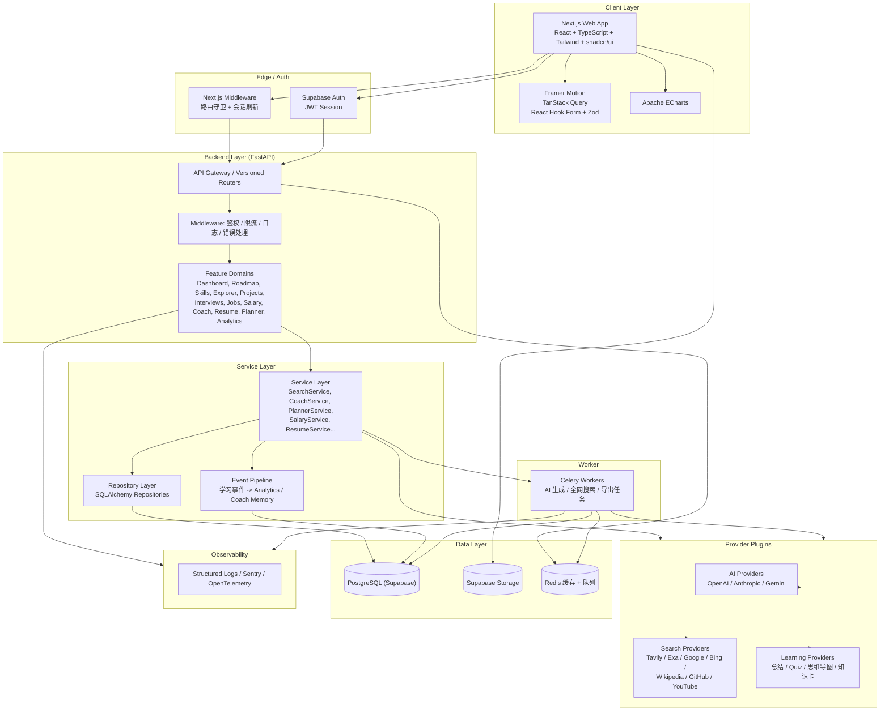
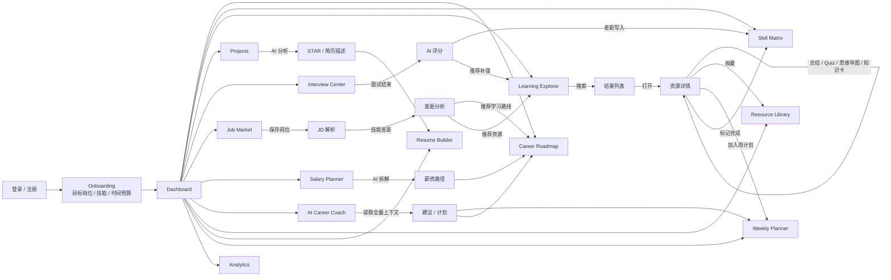
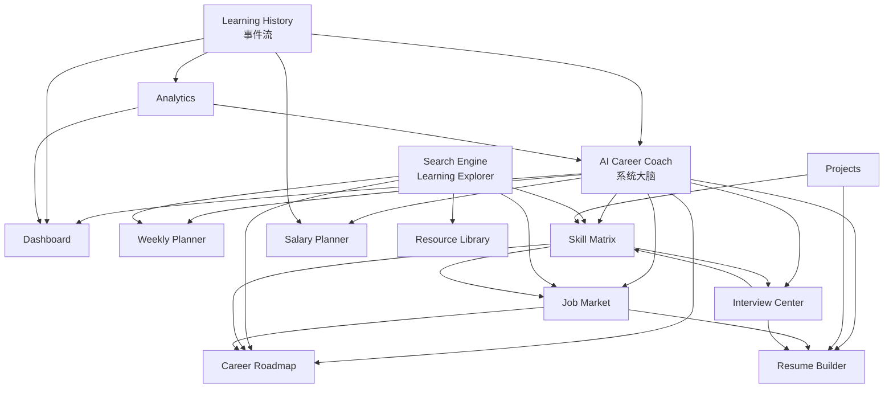
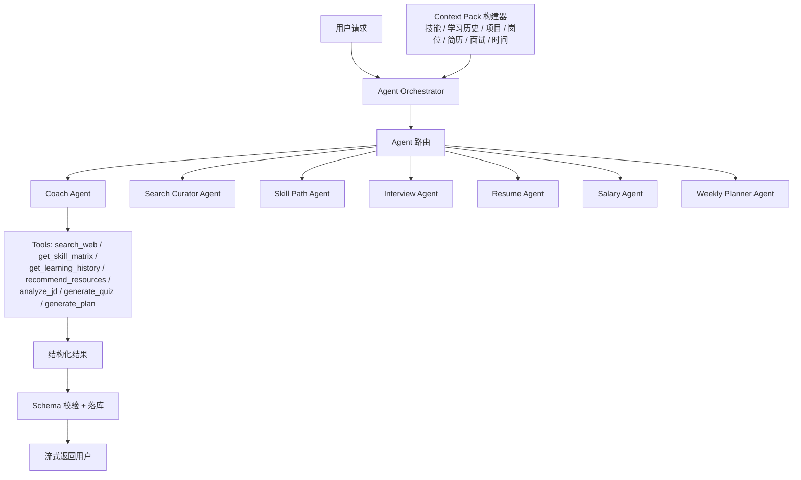

# Career OS 产品架构设计

状态：待确认（Step 1 产物）

日期：2026-07-31

文档目标：为后续产品设计、数据库设计、API 设计、UI 设计、开发、测试、部署提供统一基线。

---

## 1. 项目定位与设计原则

Career OS 是一套 AI 驱动的职业成长操作系统，核心循环为：

```text
Learn -> Practice -> Build -> Interview -> Job -> Promotion -> Repeat
```

它不是任务清单、笔记软件或课程网站，而是一个以用户职业目标为中心，把学习、作品、求职、面试、薪资、复盘串成一个闭环的系统。

关键设计原则：

1. AI 是操作系统，不是聊天框。所有 AI 能力通过 Agent + Tool 形式落地，具备分析、规划、搜索、总结、推荐、追问、生成能力。
2. 数据是单一事实源。学习记录、技能、项目、岗位、面试、简历、OKR 全部结构化存储，AI 每次回答基于实时上下文。
3. 所有外部能力插件化。AI Provider、Search Provider、Learning Provider 均可热插拔，不写死在业务代码里。
4. 学习资源实时搜索，不自建资源库。搜索结果先统一标准化，再按相关性、时效性、官方性、免费性排序。
5. Feature First + Clean Architecture。每个业务模块独立成域，内部按 Repository / Service / Router 分层。
6. 一切成长可量化。每次搜索、学习、完成、面试、项目更新都会产生事件，驱动 Analytics、日历、AI 建议。

---

## 2. 产品架构图



架构分层说明：

| 层 | 职责 | 技术 |
| --- | --- | --- |
| Client | 页面、交互、状态、表单、图表 | Next.js、React、Tailwind、shadcn/ui、Framer Motion、TanStack Query、RHF、Zod、ECharts |
| Edge | 认证会话、路由守卫 | Next.js Middleware、Supabase Auth |
| Backend | REST API、业务编排、鉴权、限流 | FastAPI、Pydantic、SQLAlchemy |
| Service | 跨模块业务逻辑、Agent 编排、事件写入 | Python Service Layer |
| Provider | 外部 AI / 搜索 / 学习能力适配 | 插件注册表 + 统一接口 |
| Data | 结构化数据、文件、缓存 | Supabase PostgreSQL、Supabase Storage、Redis |
| Worker | 长任务异步执行 | Celery |
| Observability | 日志、错误、指标 | Python logging、Sentry、OpenTelemetry |

---

## 3. 技术选型

| 类别 | 选型 | 理由 |
| --- | --- | --- |
| Web 框架 | Next.js 最新稳定版（App Router） | SSR / RSC、Vercel 部署、生态成熟 |
| UI | TailwindCSS + shadcn/ui + Framer Motion | 与 Linear / Stripe / Vercel 风格一致，可维护性好 |
| 数据请求 | TanStack Query | 缓存、重试、乐观更新 |
| 表单 | React Hook Form + Zod | 类型安全、服务端与客户端 schema 共享 |
| 图表 | Apache ECharts | 成长趋势、技能雷达、日历热力图 |
| API | FastAPI | 异步、Pydantic 校验、自动 OpenAPI |
| ORM | SQLAlchemy 2.x + Alembic | 成熟、迁移友好 |
| 数据库 | PostgreSQL（Supabase） | 关系模型 + JSONB + RLS + 托管 |
| Auth | Supabase Auth | 邮箱、OAuth、JWT、RLS 联动 |
| Storage | Supabase Storage | 文件上传、签名 URL、CDN |
| 队列 | Celery + Redis | AI / 搜索 / 导出长任务 |
| AI | 讯飞星火 Spark-X2-Flash（默认）+ OpenAI / Anthropic / Gemini（可选） | 免费低门槛，Provider 插件化可切换 |
| 搜索 | Tavily / Exa / Google / Bing / Wikipedia / GitHub / YouTube 插件 | 实时搜索，不维护资源库 |
| 语音 | 浏览器 MediaRecorder + Web Speech API | 语音面试录音与浏览器端转写 |
| 部署 | Vercel + Render + Supabase 免费套餐 | 无需账号域名即可上线，后续可迁 Railway + Docker |
| 监控 | Sentry + OpenTelemetry | 错误与性能可观测 |

---

## 4. 领域模型总览

系统分为 12 个业务域，每个域独立演进：

1. Dashboard：汇总学习进度、技能成长、OKR、作品、学习时间、成长趋势、日历、AI 建议。
2. Roadmap：3 / 5 / 10 年职业路线，AI 生成、手动修改、拖拽排序、里程碑完成。
3. Skill Matrix：技能树、当前等级、目标等级、成长建议、推荐资源、推荐项目。
4. Learning Explorer：AI 学习搜索引擎，实时搜索 + AI 排序 + 资源能力（总结、Quiz、思维导图、知识卡）。
5. Projects：作品集、多格式文件、AI 生成 STAR / 项目介绍 / 简历描述。
6. Interview Center：模拟面试、行为 / 技术 / STAR 面试、AI 评分。
7. Job Market：保存岗位、解析 JD、技能差距分析、推荐学习路线。
8. Salary Planner：目标薪资拆解为技能、项目、岗位、时间线。
9. AI Career Coach：基于全量用户上下文回答“下一步学什么、如何跳槽、如何涨薪”。
10. Resource Library：收藏资源、标签、搜索、笔记、学习记录。
11. Resume Builder：中英文简历生成、版本管理、导出。
12. Weekly Planner：AI 生成周计划、每日任务、预计时间。

---

## 5. 数据库设计

### 5.1 ER 图（逻辑级）

```mermaid
erDiagram
    profiles ||--o{ user_skills : has
    skills ||--o{ user_skills : measured_by
    profiles ||--o{ okrs : owns
    okrs ||--o{ okr_key_results : contains
    profiles ||--o{ roadmaps : owns
    roadmaps ||--o{ roadmap_milestones : contains
    profiles ||--o{ learning_history : records
    profiles ||--o{ study_sessions : has
    profiles ||--o{ user_resource_states : owns
    learning_resources ||--o{ user_resource_states : tracked_by
    profiles ||--o{ bookmarks : owns
    learning_resources ||--o{ bookmarks : bookmarked_by
    bookmarks ||--o{ bookmark_tags : tagged
    tags ||--o{ bookmark_tags : used_by
    profiles ||--o{ search_queries : runs
    search_queries ||--o{ search_results : contains
    learning_resources o|--o{ search_results : matched
    profiles ||--o{ projects : owns
    projects ||--o{ project_files : contains
    projects ||--o{ project_analyses : has
    profiles ||--o{ jobs : tracks
    jobs ||--o{ job_analyses : has
    profiles ||--o{ interviews : owns
    interviews ||--o{ interview_sessions : has
    interview_sessions ||--o{ interview_questions : contains
    interview_sessions ||--o{ interview_feedback : receives
    profiles ||--o{ resumes : owns
    resumes ||--o{ resume_versions : versions
    profiles ||--o{ ai_chats : has
    ai_chats ||--o{ ai_messages : contains
    profiles ||--o{ weekly_plans : has
    weekly_plans ||--o{ plan_tasks : contains
    profiles ||--o{ salary_plans : has
    profiles ||--o{ notifications : receives
    profiles ||--o{ audit_logs : generates
```



### 5.2 核心表清单

#### 用户域

| 表 | 说明 | 关键字段 |
| --- | --- | --- |
| profiles | 用户画像 | id, auth_user_id, email, display_name, avatar_url, current_title, company, target_title, target_salary, currency, timezone, language, onboarding_completed, preferences(jsonb) |
| notifications | 站内通知 | id, user_id, type, title, body, read_at, link |
| audit_logs | 审计日志 | id, user_id, action, entity_type, entity_id, metadata, ip |

#### 技能与目标

| 表 | 说明 | 关键字段 |
| --- | --- | --- |
| skills | 技能目录（共享） | id, name, category, description, icon, tags, is_ai_generated |
| user_skills | 用户技能状态 | id, user_id, skill_id, current_level(1-10), target_level, confidence, notes, updated_at，唯一约束(user_id, skill_id) |
| okrs | OKR | id, user_id, title, objective, cycle_start, cycle_end, status, progress, ai_generated |
| okr_key_results | KR | id, okr_id, title, metric_type, target_value, current_value, unit, sort_order |

#### 职业路线

| 表 | 说明 | 关键字段 |
| --- | --- | --- |
| roadmaps | 职业路线 | id, user_id, title, horizon_years(3/5/10), status, source(ai/custom), metadata |
| roadmap_milestones | 路线里程碑 | id, roadmap_id, title, description, phase, target_date, sort_order, status |

#### 学习域

| 表 | 说明 | 关键字段 |
| --- | --- | --- |
| learning_resources | 学习资源（共享目录） | id, url(unique), title, description, provider, resource_type, source_name, thumbnail_url, language, difficulty, duration_minutes, published_at, author, license, metadata, normalized_hash |
| user_resource_states | 用户资源状态 | id, user_id, resource_id, status(saved/in_progress/completed/archived), progress, rating, notes, started_at, completed_at，唯一约束(user_id, resource_id) |
| bookmarks | 收藏 | id, user_id, resource_id, note, created_at |
| tags | 标签（用户级） | id, user_id, name, color |
| bookmark_tags | 收藏标签关联 | id, bookmark_id, tag_id |
| search_queries | 搜索记录 | id, user_id, query, providers, filters, result_count, ai_reranked, latency_ms |
| search_results | 搜索结果 | id, query_id, resource_id, provider, rank, score, title, url, snippet, metadata |
| learning_history | 学习事件流 | id, user_id, resource_id, action(search/view/summary/quiz/note/chat/complete), topic, duration_minutes, metadata, occurred_at |
| study_sessions | 学习会话 | id, user_id, resource_id, started_at, ended_at, duration_minutes, topic, notes, focus_score |

#### 作品集

| 表 | 说明 | 关键字段 |
| --- | --- | --- |
| projects | 项目 | id, user_id, title, description, status, role, url, repo_url, cover_url, tags, highlight |
| project_files | 项目文件 | id, project_id, storage_path, original_name, file_type, mime_type, size_bytes |
| project_analyses | AI 分析结果 | id, project_id, analysis_type(star/intro/resume), content(jsonb), ai_provider, ai_model, status, error |

#### 求职与薪资

| 表 | 说明 | 关键字段 |
| --- | --- | --- |
| jobs | 保存的岗位 | id, user_id, title, company, location, url, source, salary_min, salary_max, currency, description_md, jd_raw, posted_at, status(saved/applied/interview/offer/rejected), match_score |
| job_analyses | JD 分析 | id, job_id, extracted_skills, required_experience, skill_gaps, match_score, recommendations, ai_provider, ai_model |
| salary_plans | 薪资规划 | id, user_id, target_salary, current_salary, currency, horizon_years, assumptions, breakdown(jsonb), status |

#### 面试

| 表 | 说明 | 关键字段 |
| --- | --- | --- |
| interviews | 面试配置 | id, user_id, title, interview_type(mock/real), mode(behavioral/technical/star), role, language, difficulty, status, config |
| interview_sessions | 面试会话 | id, interview_id, user_id, started_at, ended_at, transcript(jsonb), audio_paths(jsonb), ai_provider, ai_model, status |
| interview_questions | 面试问题 | id, session_id, question, type, expected_keywords, difficulty, sort_order |
| interview_feedback | 面试反馈 | id, session_id, overall_score, dimensions(jsonb), strengths, improvements, sample_answer |

#### 简历

| 表 | 说明 | 关键字段 |
| --- | --- | --- |
| resumes | 简历 | id, user_id, title, language(zh/en), status, template, sections(jsonb), version |
| resume_versions | 简历版本 | id, resume_id, version, content(jsonb), change_note |

#### AI 对话与计划

| 表 | 说明 | 关键字段 |
| --- | --- | --- |
| ai_chats | AI 对话 | id, user_id, channel(coach/skill/resource/interview/salary/planner), title, context(jsonb) |
| ai_messages | 消息 | id, chat_id, role, content, tool_calls(jsonb), provider, model, tokens_in, tokens_out, latency_ms |
| weekly_plans | 周计划 | id, user_id, week_start, title, status, ai_generated |
| plan_tasks | 计划任务 | id, plan_id, title, day, estimated_minutes, resource_id, status, sort_order, notes |

#### 系统域

| 表 | 说明 | 关键字段 |
| --- | --- | --- |
| provider_configs | Provider 配置 | id, provider_type(ai/search/learning), provider_name, config_encrypted(jsonb), is_enabled, is_default, priority |
| background_jobs | 后台任务 | id, job_type, payload, status(queued/running/succeeded/failed), attempts, error, result |

设计要点：

- 所有业务表带 user_id 外键，配合 Supabase RLS 做行级隔离。
- 长文本 / 结构化 AI 产物存 JSONB，避免过度拆表。
- learning_history 是事件流，驱动 Analytics、日历、Coach 记忆，不做软删。
- Provider 密钥加密存储，只允许系统级管理员修改。

---

## 6. API 设计

### 6.1 通用约定

- 统一前缀：/api/v1
- 认证：Authorization: Bearer <supabase_jwt>，FastAPI 校验 JWT 并注入当前用户。
- 响应格式：成功 { data }；列表 { data, meta: { page, limit, total } }；失败 { error: { code, message, details } }。
- 分页：page 与 limit 参数，默认 limit=20，上限 100。
- 长任务：AI 生成 / 全网搜索接口返回 202 + background_jobs.id，客户端轮询或订阅。
- 幂等：生成类接口支持 Idempotency-Key 请求头，防止重复扣费 / 重复创建。
- 流式：对话类接口返回 text/event-stream（SSE）。

### 6.2 端点总览

#### Auth / Onboarding

| Method | Path | 说明 |
| --- | --- | --- |
| POST | /auth/callback | Supabase 回调后同步 profile |
| GET | /me | 当前用户信息 |
| PATCH | /me | 更新用户信息 |
| GET | /onboarding/status | 获取引导完成状态 |
| POST | /onboarding | 提交引导（目标、技能、OKR、时间预算） |

#### Dashboard

| Method | Path | 说明 |
| --- | --- | --- |
| GET | /dashboard/summary | 学习进度、技能、OKR、作品、学习时间汇总 |
| GET | /dashboard/trends?range=7d/30d/90d | 成长趋势 |
| GET | /dashboard/calendar?month= | 学习日历 |
| GET | /dashboard/ai-advice | AI 建议 |
| GET | /dashboard/recent | 近期学习、近期项目、待办 |

#### Roadmap

| Method | Path | 说明 |
| --- | --- | --- |
| GET/POST | /roadmaps | 列表 / 创建 |
| GET/PATCH/DELETE | /roadmaps/{id} | 详情 / 修改 / 删除 |
| POST | /roadmaps/{id}/generate | AI 生成路线（3/5/10 年） |
| POST | /roadmaps/{id}/milestones | 新增里程碑 |
| PATCH/DELETE | /roadmaps/{id}/milestones/{mid} | 更新 / 删除里程碑 |
| PUT | /roadmaps/{id}/milestones/order | 拖拽排序 |

#### Skill Matrix

| Method | Path | 说明 |
| --- | --- | --- |
| GET | /skills | 技能目录 |
| GET | /skills/matrix | 用户技能矩阵 |
| PUT | /skills/{skillId}/progress | 更新当前 / 目标等级 |
| POST | /skills/{skillId}/recommendations | AI 推荐资源与项目 |
| POST | /skills/{skillId}/path | AI 生成该技能成长路径 |

#### Learning Explorer

| Method | Path | 说明 |
| --- | --- | --- |
| POST | /explore/search | 发起实时搜索（异步） |
| GET | /explore/jobs/{jobId} | 查询搜索结果 |
| GET | /explore/history | 搜索历史 |
| GET | /explore/providers | 可用搜索 Provider |
| GET | /explore/resources/{id} | 资源详情 |
| POST | /explore/resources/{id}/summary | AI 总结 |
| POST | /explore/resources/{id}/key-points | 重点提炼 |
| POST | /explore/resources/{id}/mindmap | 思维导图 |
| POST | /explore/resources/{id}/quiz | 生成 Quiz |
| POST | /explore/resources/{id}/cards | 生成知识卡 |
| POST | /explore/resources/{id}/ask | 基于资源继续提问 |
| POST | /explore/resources/{id}/state | 更新学习状态 / 进度 |
| POST | /explore/resources/{id}/bookmark | 收藏 / 取消收藏 |

#### Projects

| Method | Path | 说明 |
| --- | --- | --- |
| GET/POST | /projects | 列表 / 创建 |
| GET/PATCH/DELETE | /projects/{id} | 详情 / 修改 / 删除 |
| POST | /projects/{id}/files | 上传文件到 Storage |
| GET | /projects/{id}/files/{fileId}/url | 获取签名 URL |
| POST | /projects/{id}/analyze | AI 生成 STAR / 介绍 / 简历描述 |
| GET | /projects/{id}/analyses | 历史分析结果 |

#### Interview Center

| Method | Path | 说明 |
| --- | --- | --- |
| GET/POST | /interviews | 列表 / 创建 |
| GET/PATCH/DELETE | /interviews/{id} | 详情 / 修改 / 删除 |
| POST | /interviews/{id}/questions | 生成题目 |
| POST | /interviews/{id}/sessions | 开始会话 |
| POST | /sessions/{id}/answer | 提交回答 |
| POST | /sessions/{id}/answers/voice | 上传语音答案与浏览器转写文本 |
| GET | /sessions/{id}/transcript | 获取会话转写 |
| POST | /sessions/{id}/finish | 结束会话 |
| GET | /sessions/{id}/feedback | AI 评分与反馈 |

#### Job Market

| Method | Path | 说明 |
| --- | --- | --- |
| GET/POST | /jobs | 列表 / 保存岗位 |
| GET/PATCH/DELETE | /jobs/{id} | 详情 / 更新状态 / 删除 |
| POST | /jobs/{id}/analyze | 解析 JD、提取技能 |
| GET | /jobs/{id}/gap | 技能差距对比 |
| GET | /jobs/{id}/learning-plan | 差距对应的学习路线 |

#### Salary Planner

| Method | Path | 说明 |
| --- | --- | --- |
| POST | /salary-plans/generate | AI 拆解目标薪资 |
| GET | /salary-plans/{id} | 规划详情 |
| PATCH | /salary-plans/{id} | 调整假设并重算 |

#### AI Career Coach

| Method | Path | 说明 |
| --- | --- | --- |
| GET/POST | /coach/chats | 会话列表 / 新建 |
| GET/DELETE | /coach/chats/{id} | 会话详情 / 删除 |
| GET | /coach/chats/{id}/messages | 历史消息 |
| POST | /coach/chats/{id}/messages | 发送消息（SSE 流式返回） |
| GET | /coach/context | 查看 AI 当前掌握的上下文摘要 |

#### Resource Library

| Method | Path | 说明 |
| --- | --- | --- |
| GET | /library/bookmarks | 收藏列表（标签 / 搜索 / 状态过滤） |
| PATCH/DELETE | /library/bookmarks/{id} | 更新笔记 / 删除 |
| GET/POST | /library/tags | 标签列表 / 创建 |
| POST | /library/bookmarks/{id}/tags | 添加标签 |

#### Resume Builder

| Method | Path | 说明 |
| --- | --- | --- |
| GET/POST | /resumes | 列表 / 创建 |
| GET/PATCH/DELETE | /resumes/{id} | 详情 / 编辑 / 删除 |
| POST | /resumes/{id}/generate | AI 生成（中 / 英文） |
| POST | /resumes/{id}/versions | 生成版本 |
| GET | /resumes/{id}/versions/{version} | 回看版本 |
| POST | /resumes/{id}/export | 导出 PDF / Word |

#### Weekly Planner

| Method | Path | 说明 |
| --- | --- | --- |
| GET | /planner/current | 当前周计划 |
| POST | /planner/generate?week= | AI 生成周计划 |
| PATCH | /planner/tasks/{id} | 修改任务 |
| POST | /planner/tasks/{id}/complete | 完成任务 |

#### Analytics

| Method | Path | 说明 |
| --- | --- | --- |
| GET | /analytics/overview | 综合看板 |
| GET | /analytics/time | 学习时间分析 |
| GET | /analytics/skills | 技能增长分析 |
| GET | /analytics/completion | 资源完成率 |
| GET | /analytics/okr | OKR 进度 |
| GET | /analytics/export | 导出 CSV |

#### Admin / System

| Method | Path | 说明 |
| --- | --- | --- |
| GET | /admin/providers | Provider 列表与状态 |
| PATCH | /admin/providers/{id} | 启用 / 禁用 / 配置 |
| POST | /admin/providers/{id}/test | 连通性测试 |
| GET | /health | 存活检查 |
| GET | /ready | 依赖就绪检查 |
| GET | /metrics | Prometheus 指标 |

---

## 7. 页面流程



页面层级说明：

1. 一级导航（左侧 Sidebar）：Dashboard、Roadmap、Skills、Explore、Projects、Interviews、Jobs、Salary、Coach、Library、Resume、Planner、Analytics。
2. Onboarding 只出现一次，完成后进入 Dashboard。
3. 资源详情是学习域的核心工作台，AI 能力入口集中于此。
4. 所有“差距”类结果都可以一键转换成路线、计划或搜索。

---

## 8. 模块关系图



模块依赖原则：

- AI Coach 只读聚合上下文，不直接改业务数据。
- Search 引擎只负责发现与标准化资源，状态由 Resource Library / Planner 管理。
- Analytics 只消费事件流，不反向写业务表。
- 技能矩阵是多个模块的共同“基准线”：面试、JD、薪资、路线都回写技能等级。

---

## 9. 目录结构

```text
career-os/
├── apps/
│   ├── web/                            # Next.js
│   │   ├── app/
│   │   │   ├── (auth)/
│   │   │   │   ├── login/
│   │   │   │   └── signup/
│   │   │   ├── (app)/
│   │   │   │   ├── dashboard/
│   │   │   │   ├── roadmap/
│   │   │   │   ├── skills/
│   │   │   │   ├── explore/
│   │   │   │   ├── projects/
│   │   │   │   ├── interviews/
│   │   │   │   ├── jobs/
│   │   │   │   ├── salary/
│   │   │   │   ├── coach/
│   │   │   │   ├── library/
│   │   │   │   ├── resume/
│   │   │   │   ├── planner/
│   │   │   │   └── analytics/
│   │   │   ├── layout.tsx
│   │   │   └── not-found.tsx
│   │   ├── components/
│   │   │   ├── ui/                     # shadcn/ui
│   │   │   └── features/
│   │   │       ├── dashboard/
│   │   │       ├── roadmap/
│   │   │       ├── skills/
│   │   │       ├── explore/
│   │   │       ├── projects/
│   │   │       ├── interviews/
│   │   │       ├── jobs/
│   │   │       ├── salary/
│   │   │       ├── coach/
│   │   │       ├── library/
│   │   │       ├── resume/
│   │   │       ├── planner/
│   │   │       └── analytics/
│   │   ├── hooks/
│   │   ├── lib/                        # api client, supabase client, query client
│   │   │   └── speech/
│   │   │       └── web_speech.ts       # 浏览器录音与 Web Speech 转写
│   │   ├── stores/
│   │   ├── styles/
│   │   └── tests/
│   └── api/                            # FastAPI
│       ├── app/
│       │   ├── main.py
│       │   ├── core/
│       │   │   ├── config.py
│       │   │   ├── security.py
│       │   │   ├── database.py
│       │   │   ├── cache.py
│       │   │   ├── logging.py
│       │   │   └── errors.py
│       │   ├── domains/                # Feature First
│       │   │   ├── dashboard/
│       │   │   │   ├── models.py
│       │   │   │   ├── schemas.py
│       │   │   │   ├── repository.py
│       │   │   │   ├── service.py
│       │   │   │   ├── router.py
│       │   │   │   └── tests/
│       │   │   ├── roadmap/
│       │   │   ├── skills/
│       │   │   ├── explorer/
│       │   │   ├── projects/
│       │   │   ├── interviews/
│       │   │   ├── jobs/
│       │   │   ├── salary/
│       │   │   ├── coach/
│       │   │   ├── library/
│       │   │   ├── resume/
│       │   │   ├── planner/
│       │   │   └── analytics/
│       │   ├── providers/
│       │   │   ├── ai/
│       │   │   │   ├── base.py
│       │   │   │   ├── openai_provider.py
│       │   │   │   ├── anthropic_provider.py
│       │   │   │   ├── gemini_provider.py
│       │   │   │   └── registry.py
│       │   │   ├── search/
│       │   │   │   ├── base.py
│       │   │   │   ├── tavily_provider.py
│       │   │   │   ├── exa_provider.py
│       │   │   │   ├── google_provider.py
│       │   │   │   ├── bing_provider.py
│       │   │   │   ├── wikipedia_provider.py
│       │   │   │   ├── github_provider.py
│       │   │   │   ├── youtube_provider.py
│       │   │   │   └── registry.py
│       │   │   └── learning/
│       │   │       ├── base.py
│       │   │       └── providers/
│       │   │   └── speech/
│       │   │       ├── base.py
│       │   │       └── registry.py
│       │   ├── agents/                 # Agent 编排
│       │   │   ├── coach_agent.py
│       │   │   ├── search_agent.py
│       │   │   ├── interview_agent.py
│       │   │   ├── resume_agent.py
│       │   │   ├── salary_agent.py
│       │   │   ├── planner_agent.py
│       │   │   └── tools/
│       │   ├── services/               # 跨域服务
│       │   ├── workers/                # Celery tasks
│       │   ├── middlewares/
│       │   ├── db/
│       │   │   ├── base.py
│       │   │   └── migrations/         # Alembic
│       │   └── seed/
│       └── tests/
├── packages/
│   ├── shared/                         # Pydantic / Zod schema 共享契约
│   ├── providers/                      # Provider SDK 抽象
│   └── config/
├── infra/
│   ├── docker/
│   │   ├── api.Dockerfile
│   │   ├── worker.Dockerfile
│   │   └── docker-compose.yml
│   ├── supabase/
│   │   ├── migrations/                 # RLS policies
│   │   └── seed.sql
│   └── terraform/                      # 可选 IaC
├── docs/
├── .github/workflows/                  # CI/CD
└── package.json / pyproject.toml
```

---

## 10. Provider 插件架构

### 10.1 Search Provider

统一接口：

```text
SearchProvider
├── name
├── capabilities: { web, video, code, docs, papers, news, social }
├── async search(query, filters) -> list[NormalizedResource]
└── async healthcheck() -> bool
```

已规划实现：

| Provider | 能力 |
| --- | --- |
| Tavily | 全网搜索、官方来源优先、结构化结果 |
| Exa | 语义搜索、相似内容、技术内容质量高 |
| Google Programmable Search | 通用网页 |
| Bing Search API | 通用网页 |
| Wikipedia | 知识条目、参考资料 |
| GitHub Search API | 代码、仓库、项目、教程 |
| YouTube Search API | 视频课程 |

处理管线：

```text
用户 Query
  -> Provider 路由（按能力 / 配置并发）
  -> 结果标准化（统一 ResourceItem schema）
  -> URL 归一化去重
  -> 评分排序（相关性 / 时效 / 官方 / 免费 / 难度匹配）
  -> 可选 AI Rerank
  -> 落库 learning_resources + search_results
```

评分模型（可配置）：

```text
score = 0.40 relevance + 0.20 recency + 0.15 quality
      + 0.15 accessibility(official/free) + 0.10 provider_confidence
```

新增 Provider 只需实现接口并注册，前端无需改动。

### 10.2 AI Provider

统一接口：

```text
AIProvider
├── async complete(messages, tools, response_format) -> AIMessage
├── async stream(messages, tools) -> AsyncIterator[AIChunk]
├── capabilities: { tools, vision, json_mode, streaming }
└── model_pricing / latency profile
```

已规划实现：讯飞星火 Spark-X2-Flash（默认）、OpenAI、Anthropic、Gemini。首版默认使用讯飞星火，API Key 与 Secret 通过环境变量注入，不写入仓库。

运行策略：

- 模型路由表：分类 / 抽取用轻量模型，规划 / 教练 / 面试用强模型。
- 故障降级：主 Provider 失败自动切换备选。
- 结构化输出：AI 结果必须通过 Pydantic schema 校验后落库。

### 10.3 Learning Provider

统一接口：

```text
LearningProvider
├── summarize(resource, user_context)
├── key_points(resource, user_context)
├── mindmap(resource)
├── quiz(resource, difficulty)
├── flashcards(resource)
└── ask(resource, question)
```

Learning Provider 基于任一 AI Provider 实现，输出统一 Schema，前端展示层不变。

### 10.4 Speech Provider

首版无服务端 ASR。语音转写在浏览器端通过 Web Speech API 完成，音频与校对后的转写文本通过 API 落库，供评分与回看使用。

保留统一接口，便于后续接入讯飞 ASR 或 Whisper：

```text
SpeechProvider
├── async transcribe(audio_path, language) -> Transcript
├── capabilities: { streaming_asr, chinese, english }
└── async healthcheck() -> bool
```

首版实现：浏览器 Web Speech API（客户端），失败降级为手动文本输入。音频存 Supabase Storage，转写文本落 interview_sessions.transcript。

---

## 11. AI Agent 架构



Agent 规则：

- 每个 Agent 只负责一个业务结果类型，输出 Pydantic 强类型结构。
- Coach 使用全量 Context Pack，但只读不改。
- 所有外部调用可追踪（provider、model、tokens、latency 写入 ai_messages / audit_logs）。

---

## 12. 核心数据流场景

### 12.1 学习搜索

1. 用户在 Explore 输入 “Power BI 从入门到进阶”。
2. 前端 POST /explore/search，携带 providers、filters。
3. SearchService 并发调用已启用的 Search Providers。
4. Worker 标准化、去重、评分、AI Rerank，写入 learning_resources 与 search_results。
5. 前端轮询任务状态，展示排序后的资源卡片。
6. 用户打开、收藏、标记学习状态，全部写入 learning_history。

### 12.2 JD 差距分析

1. 用户保存岗位 → POST /jobs。
2. POST /jobs/{id}/analyze 触发 Agent 提取 JD 技能清单。
3. 与 user_skills 对比生成差距列表与匹配分。
4. 差距可一键生成学习搜索、路线里程碑、周计划任务。

### 12.3 模拟面试闭环

1. 用户配置岗位 / 模式 → POST /interviews。
2. Agent 基于技能矩阵与目标岗位生成题目。
3. 用户逐题作答，会话流式转录。
4. 结束后 Agent 按 STAR / 结构 / 深度 / 沟通 / 技术五个维度评分。
5. 反馈自动更新技能差距，推荐补强资源。

---

## 13. 安全、合规与性能

- 认证：Supabase Auth + JWT；FastAPI 侧统一校验，禁止匿名访问业务接口。
- 数据隔离：所有表启用 RLS，策略按 auth.uid() = user_id 控制。
- 密钥：Provider 密钥加密存储，仅服务端读取，日志脱敏。
- 上传：Supabase Storage 私有桶 + 签名 URL，限制文件类型与大小。
- 限流：普通接口 60 req/min/用户；AI 生成接口 5 req/min/用户；搜索接口 10 req/min/用户。
- 成本控制：模型分级路由、缓存相同资源总结、幂等键防重复生成。
- 合规：提供数据导出与删除；AI 生成内容标记“AI 生成”；敏感 Prompt 输入做内容安全过滤。
- 性能：列表页 API 默认只返回卡片所需字段；Analytics 使用物化视图或预聚合表；搜索与 AI 任务全部异步。

---

## 14. 部署与可观测性

| 环境 | Web | API | DB |
| --- | --- | --- | --- |
| local | Next.js dev | uvicorn + 进程内任务 | docker compose Postgres（可选） |
| staging | Vercel Preview（免费） | Render 免费实例 | Supabase staging |
| production | Vercel 免费域名 | Render 免费实例 | Supabase production |

免费版部署说明：首版不使用自定义域名；Web 使用 Vercel Hobby，API 使用 Render 免费 Web Service，DB / Auth / Storage 使用 Supabase 免费套餐；长任务在 FastAPI 进程内以 BackgroundTasks + background_jobs 表实现。Celery / Redis / Railway 作为后续付费增强路径保留，不阻塞首版上线。

CI/CD：

1. GitHub Actions：lint → typecheck → unit tests → integration tests → build。
2. 数据库迁移：Alembic 迁移作为发布前置步骤。
3. 部署：Web 自动部署 Vercel；API 部署 Render；后续付费路径可切换 Railway + Docker。
4. 回滚：FastAPI 无状态多副本，Worker 幂等任务。

可观测性：

- 结构化 JSON 日志，包含 request_id、user_id（脱敏）、provider、latency。
- Sentry 收集前后端异常。
- OpenTelemetry + Prometheus 暴露 /metrics：AI 调用量、失败率、平均延迟、搜索耗时。

---

## 15. 开发里程碑建议

| 阶段 | 范围 | 目标 |
| --- | --- | --- |
| P0 | 基础框架、Auth、Onboarding、Dashboard、Skill Matrix、Learning Explorer、Resource Library、Weekly Planner | 核心学习闭环可用 |
| P1 | Roadmap、Projects、Interview Center、Job Market、Salary Planner | 职业闭环可用 |
| P2 | Resume Builder、Analytics、AI Coach 增强、Admin / Provider 管理 | 全模块完整 |

此顺序供 Step 6 开发排期参考，本阶段不做承诺。

---

## 16. 待确认事项

1. 免费版 / 付费版的功能边界是否本阶段确定。
2. AI 与搜索 Provider 的 API Key 由部署方提供，是否需要管理后台支持用户自带 Key。
3. 是否需要语音面试（录音转写）纳入 P0。
4. 部署环境是否已有 Vercel / Railway / Supabase 账号与域名。
5. 是否需要多语言（中文 / 英文）作为首版并行能力，或中文优先。

以上问题已于 2026-07-31 确认，结论见第 17 节。

---

## 17. 已确认决策（Step 1 评审结论）

1. 首版按免费版设计，不做付费墙与计费系统，通过每日限额控制 AI / 搜索成本。
2. AI Provider 默认讯飞星火 Spark-X2-Flash，使用用户提供的 APIKey / APISecret；密钥只写入本地与部署环境变量，不进入 git。
3. 语音面试纳入首版：浏览器录音 + Web Speech API 转写（无服务端 ASR），转写可校对，面试评分维度增加表达流畅度。
4. 首版无自有账号与域名，采用免费托管：Vercel（Web）+ Render（API）+ Supabase（DB / Auth / Storage）。
5. 首版支持中英文双语界面（zh-CN / en）与中英文简历；默认跟随浏览器语言并可手动切换。
6. 免费版每日限额（可在 Admin 配置）：AI 对话 30 次、学习搜索 20 次、资源 AI 总结 20 次、Quiz / 思维导图 10 次、模拟面试 3 场、简历生成 3 次、存储 500MB。
