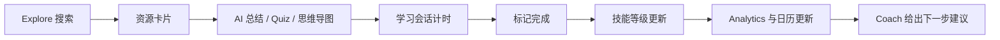
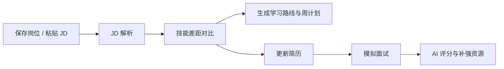
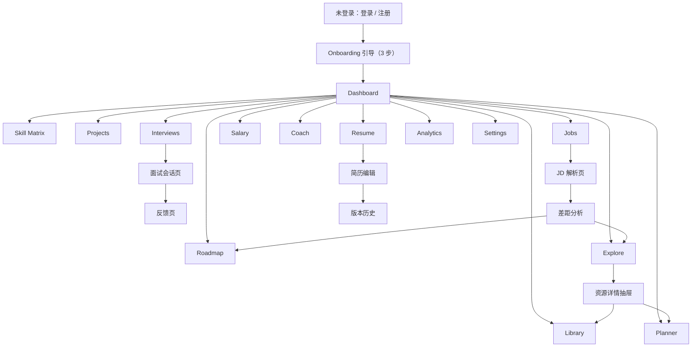
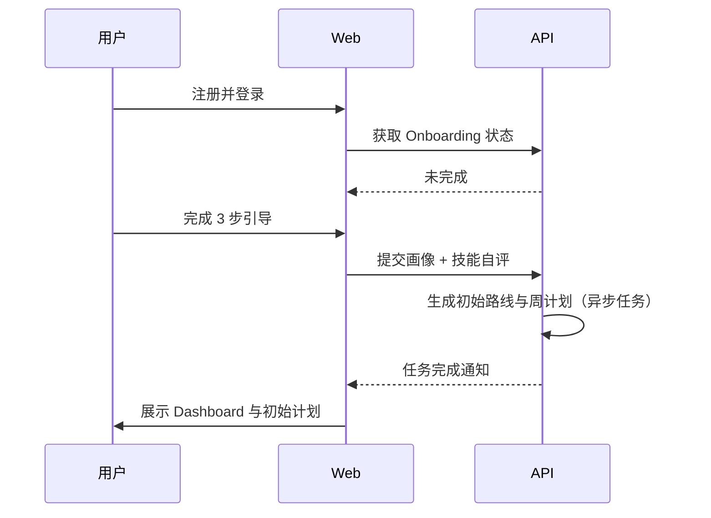
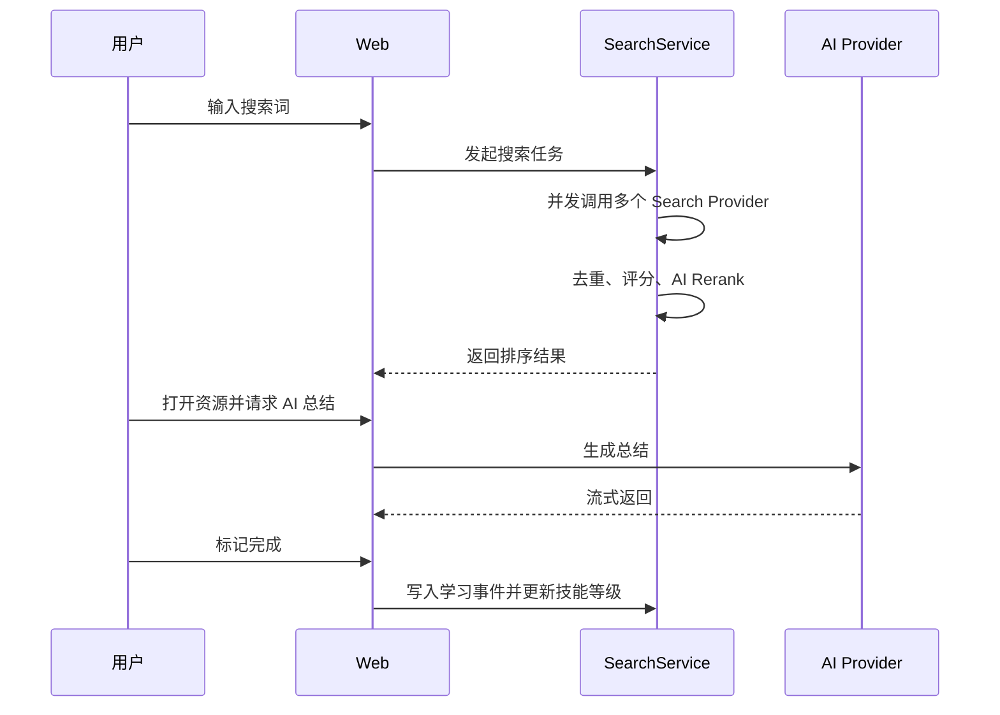
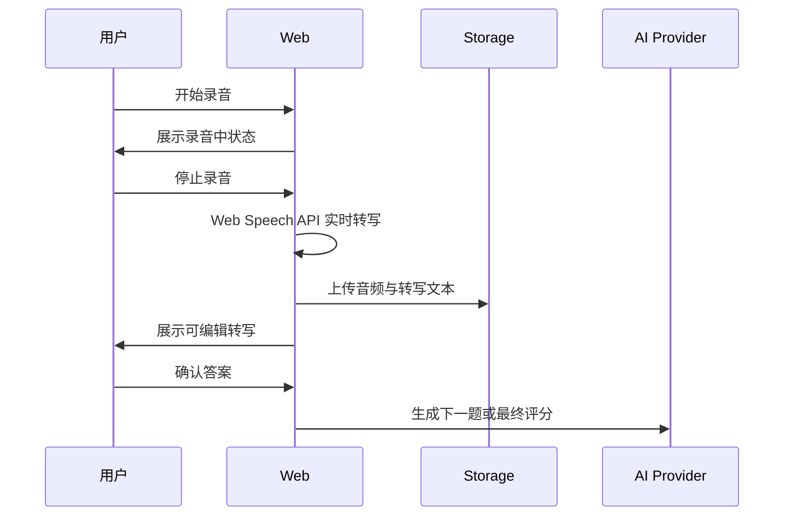
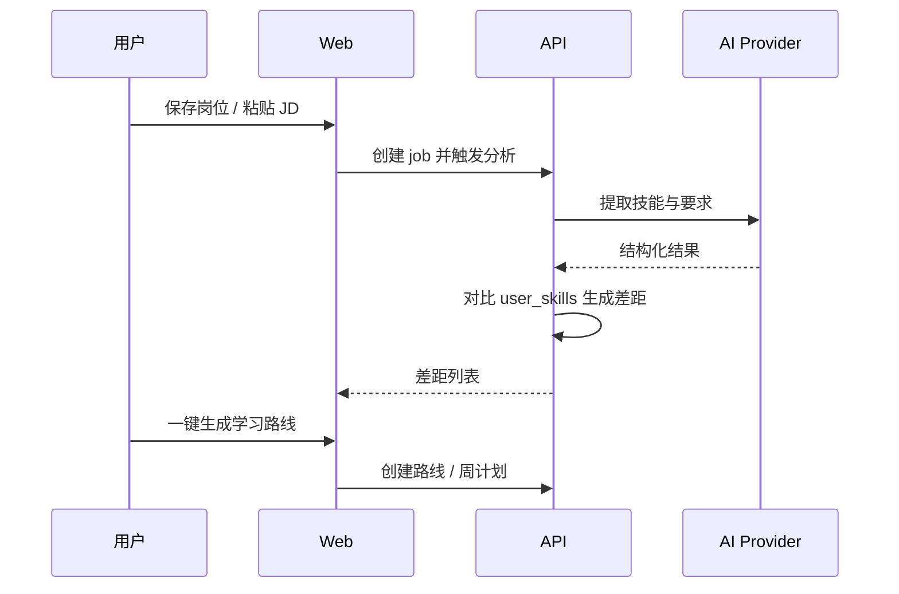

# Career OS 产品与交互设计（Step 2）

状态：待确认

日期：2026-07-31

范围：免费版 / 中文优先 / 讯飞星火 Spark-X2-Flash / 语音面试 / 免费托管

本阶段产出用户画像、核心旅程、首版范围、信息架构、页面功能规格、关键交互流程、语音面试设计、交互规范、设计系统草案与验收标准，供 Step 3 数据库设计、Step 4 API 设计、Step 5 UI 设计引用。

---

## 1. 决策基线

| 决策项 | 结论 |
| --- | --- |
| 版本 | 免费版，无付费墙与计费，通过每日限额控制 AI / 搜索成本 |
| AI Provider | 默认讯飞星火 Spark-X2-Flash，保留 OpenAI / Anthropic / Gemini 插件位 |
| 语音面试 | 纳入首版，浏览器录音 + Web Speech API 转写（无服务端 ASR） |
| 部署 | Vercel Hobby + Render 免费实例 + Supabase 免费套餐，无自定义域名 |
| 语言 | 首版中英文双语界面（zh-CN / en），简历支持中英文 |
| 密钥 | 只写入本地与部署环境变量，不进入 git 仓库 |

---

## 2. 目标用户与核心场景

### 2.1 用户画像

| 画像 | 背景 | 核心痛点 | 使用目标 |
| --- | --- | --- | --- |
| 小林：转型新人 | 市场营销专业毕业生，0-3 年经验，想转 Growth Marketing 或 Data Analyst | 不知道学什么、找不到高质量资源、没有作品、简历没亮点 | 清晰路线、精选资源、作品与面试准备 |
| 王姐：进阶骨干 | 3-5 年 Marketing Ops / PM，想晋升高级经理或转产品方向 | 技能不系统、跳槽没把握、薪资谈不上去 | 技能矩阵、JD 差距分析、模拟面试、薪资规划 |
| Alex：技术工程师 | 后端工程师，想成长到 AI 方向或 Staff 级别 | 技术栈太杂、项目不突出、系统设计面试薄弱 | 3/5/10 年路线、GitHub 项目沉淀、技术面试闭环 |

### 2.2 核心用户旅程

旅程一：新用户激活

旅程二：日常学习闭环

旅程三：求职闭环

旅程四：语音面试闭环

---

## 3. 首版范围（MoSCoW）

| 优先级 | 模块 | 首版范围 |
| --- | --- | --- |
| Must | Auth / Onboarding | 邮箱注册登录、3 步引导、生成初始路线与周计划 |
| Must | Dashboard | 统计卡、趋势图、学习日历、AI 建议、近期学习与项目、今日任务 |
| Must | Skill Matrix | 技能目录、当前 / 目标等级、AI 建议、推荐资源 |
| Must | Learning Explorer | 实时搜索、资源卡片、AI 总结 / 重点 / Quiz / 思维导图 / 知识卡 / 提问 |
| Must | Resource Library | 收藏、标签、搜索、笔记、学习状态 |
| Must | Weekly Planner | AI 生成周计划、每日任务、完成任务 |
| Must | Projects | 项目卡片、上传文件与 GitHub、AI 生成 STAR / 项目介绍 / 简历描述 |
| Must | Interview Center | 文本 + 语音面试、STAR / 行为 / 技术模式、AI 评分 |
| Must | Job Market | 保存岗位、JD 解析、技能差距、学习路线推荐 |
| Must | Salary Planner | 目标薪资拆解、技能 / 项目 / 岗位 / 时间线 |
| Must | AI Coach | 基于全量上下文对话、流式回答、可执行建议 |
| Must | Resume Builder | 中文简历自动生成、版本管理 |
| Must | Analytics | 学习时间、技能增长、完成率、OKR、项目数 |
| Should | Roadmap | 3/5/10 年时间线、AI 生成、修改、拖拽、完成 |
| Should | 全局能力 | 暗色模式、快捷键、命令面板 |
| Could | 英文简历 / 英文界面 | 后续版本 |
| Won't（首版） | 团队协作、推送通知、计费系统、多语言 | 不在免费首版范围 |

### 3.1 免费版每日限额

| 能力 | 免费限额 / 天 |
| --- | --- |
| AI Coach 对话 | 30 条消息 |
| 学习搜索 | 20 次 |
| 资源 AI 总结 / 重点提炼 | 20 次 |
| Quiz / 思维导图 / 知识卡 | 10 次 |
| 模拟面试 | 3 场 |
| 简历生成 | 3 次 |
| 项目文件存储 | 500MB |
| 普通 API | 60 req/min |
| AI 生成接口 | 5 req/min |
| 搜索接口 | 10 req/min |

限额由 Admin 配置表管理，超出后前端展示明确提示与次日重置时间。

---

## 4. 信息架构

全局导航按“成长闭环”分组：

| 分组 | 页面 |
| --- | --- |
| 总览 | Dashboard |
| 成长 | Career Roadmap、Skill Matrix、Weekly Planner、Analytics |
| 学习 | Learning Explorer、Resource Library |
| 求职 | Job Market、Interview Center、Salary Planner、Resume Builder |
| 智能 | AI Career Coach |
| 系统 | 设置、帮助、账号 |

侧边栏始终可见，移动端折叠为抽屉。所有模块入口同时出现在 Dashboard 的快捷卡片与搜索命令面板中。

---

## 5. 页面地图

---

## 6. 核心页面功能规格

### 6.1 Onboarding

目标：5 分钟内完成用户画像采集，并生成可执行的初始计划。

| 步骤 | 内容 | 交互 |
| --- | --- | --- |
| 1 | 姓名、当前岗位、公司、工作年限 | 表单 |
| 2 | 目标岗位、目标薪资、目标年份 | 选择器 + 自定义输入 |
| 3 | 从技能目录自评当前等级（1-10） | 勾选 + 滑块 |
| 4 | 每周可学习时间 | 数字选择 + 时间分配 |

完成后调用 AI 生成初始 Roadmap 与本周 Planner，再进入 Dashboard。允许跳过步骤，缺失数据用默认值补齐。

### 6.2 Dashboard

目标：一眼看到“我现在在哪、下一步做什么”。

| 区块 | 内容 |
| --- | --- |
| 顶部统计 | 本周学习时长、连续学习天数、技能完成数、项目数 |
| 成长趋势 | ECharts 折线 / 面积图（近 7/30/90 天） |
| 学习日历 | 月视图热力图 |
| OKR | 当前周期进度条 |
| AI 建议 | 一条基于上下文的下一步建议，可刷新 |
| 近期学习 | 最近资源与状态 |
| 近期项目 | 项目卡片快捷入口 |
| 今日任务 | Planner 当日任务，可勾选完成 |

交互：统计卡点击跳转对应模块；AI 建议支持“应用到周计划”与“重新生成”。

### 6.3 Career Roadmap

目标：3 / 5 / 10 年职业路线可视化并可修改。

| 能力 | 交互 |
| --- | --- |
| 时间线视图 | 按年份 / 阶段纵向展示里程碑 |
| AI 生成 | 选择年限与目标后生成，覆盖前二次确认 |
| 修改 | 里程碑标题、描述、时间就地编辑 |
| 拖拽 | 拖动改变排序与所属阶段 |
| 完成 | 里程碑标记完成，联动 Skill Matrix 与 Analytics |
| 详情 | 点击里程碑打开侧栏，关联资源、项目、面试题 |

### 6.4 Skill Matrix

目标：建立能力基准线，连接学习、求职与面试。

| 能力 | 交互 |
| --- | --- |
| 技能树 | 按分类展开技能，如 Marketing、Growth、SQL、Power BI、Python、CRM、GA4、AI Agent |
| 等级 | 当前 / 目标等级滑块，变化即时保存 |
| 雷达图 | 当前 vs 目标技能雷达 |
| 技能详情抽屉 | AI 成长建议、推荐资源、推荐项目、相关面试题 |
| 联动 | 学习完成、面试评分、JD 差距均可更新技能等级 |

### 6.5 Learning Explorer

目标：最重要的模块，AI 学习搜索引擎。

| 能力 | 交互 |
| --- | --- |
| 搜索框 | 支持自然语言，如“Power BI 从入门到进阶” |
| Provider | 可勾选 Tavily / Exa / Google / Bing / Wikipedia / GitHub / YouTube |
| 过滤器 | 类型、语言、难度、更新时间、免费 / 官方 |
| 排序 | AI 推荐、最新、免费优先 |
| 资源卡片 | 标题、简介、来源、推荐指数、难度、语言、更新时间、学习时长、打开原链接、收藏 |
| 资源详情抽屉 | 概览、AI 总结、重点提炼、思维导图、知识卡、Quiz、继续提问 |
| 学习状态 | 未开始 / 学习中 / 已完成，进度可调 |
| 快捷操作 | 收藏、加入周计划、加入路线、标记完成 |

AI 输出采用流式渲染，生成中可取消；资源打开使用新标签页并记录学习事件。

### 6.6 Resource Library

目标：管理收藏资源与个人笔记。

| 能力 | 交互 |
| --- | --- |
| 列表 | 卡片 / 列表切换，按标签、状态、时间过滤 |
| 搜索 | 标题与笔记全文搜索 |
| 标签 | 创建、重命名、删除、批量打标签 |
| 笔记 | Markdown 编辑与预览，自动保存 |
| 学习记录 | 查看该资源的历史学习时长与完成时间 |

### 6.7 Weekly Planner

目标：AI 生成可执行的本周计划。

| 能力 | 交互 |
| --- | --- |
| AI 生成 | 根据路线、技能差距、空闲时间生成 |
| 周视图 | 7 天分栏，任务含预计时长与资源链接 |
| 调整 | 拖拽换天 / 排序，修改时长 |
| 完成 | 勾选完成，计入学习事件与统计 |
| 数据来源 | 显示“来自技能差距 / Coach / 手动” |

### 6.8 Projects

目标：作品集沉淀与 AI 包装。

| 能力 | 交互 |
| --- | --- |
| 项目卡片 | 标题、角色、状态、标签、封面 |
| 创建 | 名称、角色、链接、GitHub、描述 |
| 上传 | PDF / PPT / Word / 图片 / Markdown，拖拽上传，进度显示 |
| AI 分析 | 一键生成 STAR、项目介绍、简历描述，可复制到 Resume |
| 展示 | 项目详情页聚合文件、链接、AI 结果 |

### 6.9 Interview Center

目标：模拟真实面试并形成可改进闭环。

| 能力 | 交互 |
| --- | --- |
| 创建面试 | 类型（模拟 / 真实）、模式（STAR / 行为 / 技术）、岗位、难度 |
| 题目生成 | AI 基于目标岗位与技能生成 5-8 题 |
| 答题 | 文本输入或语音录音，录音支持暂停 / 继续 / 重录 |
| 转写 | 浏览器实时转写，可编辑后提交 |
| 评分 | 总体分 + 五维（结构、STAR、深度、表达、技术） |
| 反馈 | 优点、改进点、参考答案，可导出 |
| 联动 | 差距写入 Skill Matrix，推荐补强资源 |

### 6.10 Job Market

目标：保存岗位并看清“缺什么”。

| 能力 | 交互 |
| --- | --- |
| 保存岗位 | 手动填写或粘贴 JD / URL |
| JD 解析 | AI 提取技能、年限、职责、薪资区间 |
| 匹配 | 当前能力匹配分与雷达对比 |
| 差距 | 已掌握 / 待提升 / 缺失三类技能清单 |
| 行动 | 生成学习路线、加入周计划、更新简历 |
| 状态 | 收藏 / 已投递 / 面试中 / Offer / 放弃 |

### 6.11 Salary Planner

目标：把目标薪资拆成可执行路径。

| 能力 | 交互 |
| --- | --- |
| 输入 | 当前薪资、目标薪资、年限、城市 |
| AI 拆解 | 所需技能、所需项目、岗位阶梯、时间线 |
| 调整 | 修改假设后重新计算 |
| 输出 | 阶段里程碑与可复制摘要 |

### 6.12 AI Career Coach

目标：系统大脑，回答“下一步学什么、如何跳槽、如何涨薪”。

| 能力 | 交互 |
| --- | --- |
| 对话 | SSE 流式回答 |
| 上下文 | 明确展示已纳入的技能、学习、项目、岗位、面试数据 |
| 建议卡片 | 生成周计划、推荐资源、分析 JD、生成面试题 |
| 追问 | 基于当前回答继续提问 |
| 数据开关 | 用户可选择关闭某些数据源 |

### 6.13 Resume Builder

目标：中文简历自动生成与导出。

| 能力 | 交互 |
| --- | --- |
| 生成 | 基于项目、技能、作品、目标岗位自动生成 |
| 编辑 | 分节编辑，Markdown 与分栏模板 |
| 版本 | 每次 AI 生成产生新版本，可回看 |
| 导出 | PDF 导出 |

### 6.14 Analytics

目标：量化成长，发现无效学习。

| 图表 | 说明 |
| --- | --- |
| 学习时间 | 日 / 周 / 月趋势 |
| 技能增长 | 雷达图与等级曲线 |
| 资源完成率 | 按类型与难度 |
| OKR | 目标进度 |
| 项目数 | 时间分布 |
| 导出 | CSV |

### 6.15 Settings

目标：账号、偏好与数据管理。

| 能力 | 说明 |
| --- | --- |
| 个人资料 | 头像、岗位、目标 |
| 偏好 | 语言、时区、每周计划时间、暗色模式 |
| 数据 | 导出全部数据、删除账号 |
| 限额 | 查看免费额度使用情况 |

---

## 7. 关键交互流程

### 7.1 新用户激活

### 7.2 学习闭环

### 7.3 语音面试闭环

### 7.4 JD 差距闭环

---

## 8. 语音面试详细设计

### 8.1 录音

- 浏览器 `getUserMedia` + `MediaRecorder`，输出 WebM/Opus。
- 录音面板包含开始、暂停、继续、停止、重录、时长、音量波形。
- 每题单独录音，最长 5 分钟，超时自动停止。

### 8.2 录音与浏览器转写

1. 浏览器 `getUserMedia` + `MediaRecorder` 录音。
2. 录音过程中通过 Web Speech API 实时转写中文，展示实时文本。
3. 停止录音后展示可编辑转写，用户校对后提交。
4. 音频上传 Supabase Storage：`audio/interviews/{session_id}/{question_id}.webm`，与转写文本一起落库，供回看与评分。

### 8.3 降级策略

| 优先级 | 方案 | 说明 |
| --- | --- | --- |
| 1 | 浏览器 Web Speech API | 首版无服务端 ASR，Chrome / Edge 支持中文实时转写 |
| 2 | 手动文本 | 浏览器不支持或转写失败时直接文本答题 |

### 8.4 评分维度

语音面试在原有维度上增加：

| 维度 | 说明 |
| --- | --- |
| 结构 | 回答是否有框架 |
| STAR | 是否完整包含情境、任务、行动、结果 |
| 表达 | 是否流畅、口语化重复是否过多 |
| 技术深度 | 技术题是否解释原理与权衡 |
| 时间控制 | 是否在限定时间内完整回答 |

### 8.5 隐私

- 音频仅本人可访问，转写与评分需要用户确认后保留。
- 设置中提供删除面试音频与转写的入口。

---

## 9. 全局交互规范

### 9.1 导航与全局

- 桌面端固定左侧 Sidebar，移动端抽屉。
- 全局命令面板（Ctrl/Cmd + K）：搜索页面、资源、技能、快捷操作。
- 键盘导航：`/` 聚焦搜索，`Esc` 关闭弹层与抽屉，`Enter` 确认。

### 9.2 拖拽

- Roadmap 里程碑与 Planner 任务支持拖拽排序。
- 拖拽使用 Framer Motion，松手后调用排序接口，失败自动回滚并提示。

### 9.3 AI 输出

- 所有 AI 生成均显示“AI 生成”标记。
- 长输出使用 SSE 流式渲染，显示光标与停止按钮。
- 生成失败提供重试，不重复计费（幂等键）。
- 额度不足时先提示，不允许静默降级。

### 9.4 表单

- React Hook Form + Zod 校验，错误内联显示。
- 提交中禁用按钮并显示状态。
- 破坏性操作（删除路线、覆盖生成、删除账号）需要二次确认。

### 9.5 反馈

- 操作成功使用轻量 Toast，不打断当前流程。
- 页面级错误显示重试与错误码。
- 保存类操作支持乐观更新，失败回滚。

### 9.6 主题与响应式

- 亮色 / 暗色跟随系统并可手动切换。
- 桌面 1280+ 展示多栏，平板 768-1279 使用两栏与抽屉，移动端单栏。
- 图表随容器自适应，移动端隐藏次要图例。

---

## 10. 设计系统草案

Step 5 将输出完整 UI 设计，本阶段先确定基础 token，避免多模块风格漂移。

| Token | 亮色 | 暗色 | 用途 |
| --- | --- | --- | --- |
| bg | #FAFAFA | #09090B | 页面背景 |
| surface | #FFFFFF | #18181B | 卡片 / 面板 |
| border | #E4E4E7 | #27272A | 分割线 |
| text | #18181B | #FAFAFA | 主文本 |
| muted | #71717A | #A1A1AA | 次要文本 |
| primary | #2563EB | #3B82F6 | 主操作 |
| success | #16A34A | #22C55E | 完成 / 正向 |
| warning | #D97706 | #F59E0B | 待提升 |
| danger | #DC2626 | #EF4444 | 删除 / 失败 |

| 样式 | 值 |
| --- | --- |
| 卡片圆角 | 8px |
| 控件圆角 | 6px |
| 字体 | Inter + 系统中文字体栈 |
| 基础字号 | 14px，密集工作台风格 |
| 卡片阴影 | 0 1px 2px rgba(0,0,0,0.05) |
| 间距基准 | 4px 倍数 |

原则：白底、低饱和、蓝色单主色、克制阴影、信息密度优先，不做营销式大卡片。

---

## 11. 页面状态规范

| 状态 | 规范 |
| --- | --- |
| 空状态 | 展示一句说明 + 一个主行动按钮，如“还没有收藏，先去 Explore 搜索” |
| 加载 | 列表用 skeleton，区块用浅色骨架；AI 生成用流式光标 |
| 错误 | 统一错误面板，含错误码与重试 |
| 限额 | 展示“今日已用完，明天 0 点重置”，并列出可用额度 |
| 免费托管冷启动 | Render 免费实例休眠后首次请求较慢，前端自动重试并显示“首次加载可能需要一点时间” |

---

## 12. 模块验收标准

| 模块 | 验收标准 |
| --- | --- |
| Onboarding | 新用户 5 分钟内完成引导，并看到初始路线与周计划 |
| Dashboard | 所有统计与图表基于真实数据，点击可跳转 |
| Roadmap | 3/5/10 年切换、AI 生成、拖拽、完成状态正确持久化 |
| Skill Matrix | 等级修改即时保存，联动雷达图与建议 |
| Explore | 输入关键词后异步返回排序结果，卡片字段完整，AI 能力可流式使用 |
| Library | 收藏、标签、笔记、学习状态可跨模块同步 |
| Planner | 生成、拖拽、完成均落库并更新学习统计 |
| Projects | 支持规定文件类型上传，AI 输出可复制到简历 |
| Interviews | 文本与语音答题均可评分，语音可重录与校对 |
| Jobs | JD 解析与差距对比准确，可一键生成路线 |
| Salary | 目标薪资可拆解为技能、项目、岗位、时间线 |
| Coach | 回答基于真实上下文，建议卡片可执行 |
| Resume | 自动生成中文简历并可导出 PDF |
| Analytics | 数据与学习事件一致，支持导出 |

---

## 13. 已确认决策（Step 2 评审结论）

1. 注册方式为邮箱 + 密码，不做游客演示模式。
2. 接受 Render 免费实例冷启动延迟，前端自动重试并提示。
3. 无服务端语音转写，语音面试使用浏览器 Web Speech API，失败降级为手动文本输入。

以上决策已同步至 Step 1 架构文档，进入 Step 3 数据库设计。
