# Career OS 数据库设计（Step 3）

状态：待确认

日期：2026-07-31

范围：免费版 / 中文优先 / 讯飞星火 Spark-X2-Flash / 语音面试（浏览器转写）/ Supabase PostgreSQL

本阶段在 Step 1 ER 图基础上完成全部表结构、约束、索引、RLS、存储桶、种子数据与迁移策略设计。Step 6 将据此生成 Alembic 迁移与 Supabase SQL。

---

## 1. 设计规范

通用约定：

| 项 | 约定 |
| --- | --- |
| 主键 | `id uuid primary key default gen_random_uuid()` |
| 时间 | `created_at timestamptz not null default now()`，`updated_at timestamptz` |
| 用户隔离 | 用户数据表均含 `user_id uuid not null references auth.users(id) on delete cascade` |
| 状态字段 | 使用 `text + check`，不使用 PostgreSQL enum，便于后续扩展 |
| 灵活结构 | AI 产物、筛选条件、偏好使用 `jsonb` |
| 软删除 | projects、resumes、roadmaps 使用 `deleted_at`，其余用状态归档 |
| 命名 | 表名复数 snake_case，索引 `ix_{table}_{column}`，唯一 `uq_{table}_{cols}`，外键 `fk_{table}_{column}` |
| RLS | 所有业务表启用行级安全，策略统一为 `user_id = auth.uid()` |
| 级联 | 用户删除时级联删除其业务数据；共享目录表不级联 |

说明：子表冗余 `user_id` 是刻意设计，用于 RLS 直接判定与查询路由，避免每次子查询父表。

---

## 2. ER 图（详细版）

```mermaid
erDiagram
    profiles ||--o{ user_skills : has
    skills ||--o{ user_skills : measured_by
    profiles ||--o{ user_limits : limits
    profiles ||--o{ okrs : owns
    okrs ||--o{ okr_key_results : contains
    profiles ||--o{ roadmaps : owns
    roadmaps ||--o{ roadmap_milestones : contains
    profiles ||--o{ learning_history : records
    profiles ||--o{ learning_history_aggregates : aggregates
    profiles ||--o{ study_sessions : has
    profiles ||--o{ user_resource_states : owns
    learning_resources ||--o{ user_resource_states : tracked_by
    profiles ||--o{ bookmarks : owns
    learning_resources ||--o{ bookmarks : bookmarked_by
    bookmarks ||--o{ bookmark_tags : tagged
    tags ||--o{ bookmark_tags : used_by
    profiles ||--o{ search_queries : runs
    search_queries ||--o{ search_results : contains
    learning_resources o|--o{ search_results : matched
    profiles ||--o{ projects : owns
    projects ||--o{ project_files : contains
    projects ||--o{ project_analyses : has
    profiles ||--o{ jobs : tracks
    jobs ||--o{ job_analyses : has
    profiles ||--o{ salary_plans : has
    profiles ||--o{ interviews : owns
    interviews ||--o{ interview_sessions : has
    interview_sessions ||--o{ interview_questions : contains
    interview_sessions ||--o{ interview_answers : receives
    interview_sessions ||--o{ interview_feedback : receives
    profiles ||--o{ resumes : owns
    resumes ||--o{ resume_versions : versions
    profiles ||--o{ ai_chats : has
    ai_chats ||--o{ ai_messages : contains
    profiles ||--o{ weekly_plans : has
    weekly_plans ||--o{ plan_tasks : contains
    profiles ||--o{ notifications : receives
    profiles ||--o{ background_jobs : triggers
    profiles ||--o{ audit_logs : generates
```



---

## 3. 表结构详设

### 3.1 用户域

#### profiles

用途：用户画像与职业目标，注册时由 auth.users 触发器创建。

| 字段 | 类型 | 约束与说明 |
| --- | --- | --- |
| id | uuid | PK，FK auth.users(id) |
| email | text | not null unique |
| display_name | text | 显示名 |
| avatar_url | text | 头像 URL |
| current_title | text | 当前岗位 |
| company | text | 当前公司 |
| target_title | text | 目标岗位 |
| target_salary | numeric(12,2) | 目标年薪 |
| currency | text | default 'CNY' |
| experience_years | numeric(4,1) | 工作年限 |
| timezone | text | default 'Asia/Shanghai' |
| language | text | default 'zh-CN'，支持 en |
| weekly_study_minutes | int | default 420，每周可学习分钟 |
| onboarding_completed | boolean | default false |
| preferences | jsonb | default '{}'，主题、紧凑模式、AI 数据源开关 |
| created_at | timestamptz | default now() |
| updated_at | timestamptz | 自动更新 |

#### user_limits

用途：免费版每日限额计数，一行代表某用户某一天。

| 字段 | 类型 | 约束与说明 |
| --- | --- | --- |
| id | uuid | PK |
| user_id | uuid | FK auth.users(id) |
| quota_date | date | default current_date |
| ai_messages_used | int | default 0 |
| searches_used | int | default 0 |
| ai_summaries_used | int | default 0 |
| quiz_used | int | default 0 |
| interviews_used | int | default 0 |
| resumes_generated | int | default 0 |
| storage_bytes_used | bigint | default 0 |
| created_at | timestamptz | default now() |
| updated_at | timestamptz | 自动更新 |

唯一约束：uq_user_limits_user_date(user_id, quota_date)。

#### limit_configs

用途：限额配置与功能开关。

| 字段 | 类型 | 约束与说明 |
| --- | --- | --- |
| id | uuid | PK |
| config_key | text | not null unique |
| config_value | jsonb | 配置值 |
| description | text | 说明 |
| updated_at | timestamptz | 自动更新 |

#### notifications

用途：站内通知。

| 字段 | 类型 | 约束与说明 |
| --- | --- | --- |
| id | uuid | PK |
| user_id | uuid | FK auth.users(id) |
| type | text | search_completed / interview_feedback / quota_exceeded / system |
| title | text | not null |
| body | text | 正文 |
| read_at | timestamptz | null 表示未读 |
| link | text | 跳转路径 |
| created_at | timestamptz | default now() |

#### audit_logs

用途：审计与安全事件，仅服务端写入。

| 字段 | 类型 | 约束与说明 |
| --- | --- | --- |
| id | uuid | PK |
| user_id | uuid | 可空，系统事件为空 |
| action | text | create / update / delete / export / ai_call |
| entity_type | text | 实体名 |
| entity_id | uuid | 实体 id |
| metadata | jsonb | 事件详情 |
| ip | inet | 来源 IP |
| created_at | timestamptz | default now() |

### 3.2 技能与目标

#### skills

用途：共享技能目录。

| 字段 | 类型 | 约束与说明 |
| --- | --- | --- |
| id | uuid | PK |
| name | text | not null unique |
| category | text | Marketing / Growth / Data / Engineering / Product / AI / Ops |
| description | text | 技能说明 |
| icon | text | 图标名 |
| tags | jsonb | default '[]' |
| is_ai_generated | boolean | default false |
| created_at | timestamptz | default now() |

#### user_skills

用途：用户技能当前与目标等级。

| 字段 | 类型 | 约束与说明 |
| --- | --- | --- |
| id | uuid | PK |
| user_id | uuid | FK auth.users(id) |
| skill_id | uuid | FK skills(id) |
| current_level | smallint | check 1-10 |
| target_level | smallint | check 1-10 |
| confidence | numeric(5,2) | default 0，0-100 |
| notes | text | 自评备注 |
| updated_at | timestamptz | 自动更新 |

唯一约束：uq_user_skills_user_skill(user_id, skill_id)。

#### okrs

用途：职业目标与周期。

| 字段 | 类型 | 约束与说明 |
| --- | --- | --- |
| id | uuid | PK |
| user_id | uuid | FK auth.users(id) |
| title | text | not null |
| objective | text | 目标描述 |
| cycle_start | date | 周期开始 |
| cycle_end | date | 周期结束 |
| status | text | check active / completed / archived |
| progress | numeric(5,2) | default 0，0-100 |
| ai_generated | boolean | default false |
| created_at | timestamptz | default now() |
| updated_at | timestamptz | 自动更新 |

#### okr_key_results

用途：OKR 关键结果。

| 字段 | 类型 | 约束与说明 |
| --- | --- | --- |
| id | uuid | PK |
| okr_id | uuid | FK okrs(id) on delete cascade |
| user_id | uuid | FK auth.users(id) |
| title | text | not null |
| metric_type | text | count / hours / level / score / percent |
| target_value | numeric(12,2) | 目标值 |
| current_value | numeric(12,2) | default 0 |
| unit | text | 单位 |
| sort_order | int | default 0 |
| status | text | check active / done / archived |
| updated_at | timestamptz | 自动更新 |

### 3.3 职业路线

#### roadmaps

| 字段 | 类型 | 约束与说明 |
| --- | --- | --- |
| id | uuid | PK |
| user_id | uuid | FK auth.users(id) |
| title | text | not null |
| horizon_years | smallint | check 3 / 5 / 10 |
| status | text | check draft / active / archived |
| source | text | check ai / custom |
| metadata | jsonb | 生成参数与版本 |
| created_at | timestamptz | default now() |
| updated_at | timestamptz | 自动更新 |
| deleted_at | timestamptz | 软删除 |

#### roadmap_milestones

| 字段 | 类型 | 约束与说明 |
| --- | --- | --- |
| id | uuid | PK |
| roadmap_id | uuid | FK roadmaps(id) on delete cascade |
| user_id | uuid | FK auth.users(id) |
| title | text | not null |
| description | text | 里程碑说明 |
| phase | text | 阶段名，如 基础 / 进阶 / 实战 |
| target_date | date | 目标日期 |
| sort_order | int | 拖拽排序值 |
| status | text | check planned / in_progress / done |
| tags | jsonb | default '[]' |
| created_at | timestamptz | default now() |
| updated_at | timestamptz | 自动更新 |

### 3.4 学习域

#### learning_resources

用途：全网搜索标准化后的共享资源目录，不包含用户私有数据。

| 字段 | 类型 | 约束与说明 |
| --- | --- | --- |
| id | uuid | PK |
| url | text | not null unique，原链接 |
| normalized_url | text | not null unique，去参归一化 URL |
| title | text | not null |
| description | text | 简介 |
| provider | text | check tavily / exa / google / bing / wikipedia / github / youtube / manual / other |
| resource_type | text | check document / course / video / blog / book / paper / podcast / article / other |
| source_name | text | 来源站点名 |
| thumbnail_url | text | 封面 |
| language | text | default 'zh' |
| difficulty | text | check beginner / intermediate / advanced / mixed |
| duration_minutes | int | 预计学习时长 |
| published_at | timestamptz | 发布时间 |
| author | text | 作者 |
| license | text | 许可 |
| is_official | boolean | default false |
| is_free | boolean | default true |
| metadata | jsonb | 站点、话题、相关链接 |
| normalized_hash | text | 内容指纹，用于去重 |
| created_at | timestamptz | default now() |
| updated_at | timestamptz | 自动更新 |

#### user_resource_states

| 字段 | 类型 | 约束与说明 |
| --- | --- | --- |
| id | uuid | PK |
| user_id | uuid | FK auth.users(id) |
| resource_id | uuid | FK learning_resources(id) on delete cascade |
| status | text | check saved / in_progress / completed / archived |
| progress | smallint | check 0-100 |
| rating | smallint | check 1-5，可空 |
| notes | text | 个人笔记 |
| started_at | timestamptz | 开始时间 |
| completed_at | timestamptz | 完成时间 |
| updated_at | timestamptz | 自动更新 |

唯一约束：uq_user_resource_states_user_resource(user_id, resource_id)。

#### bookmarks

| 字段 | 类型 | 约束与说明 |
| --- | --- | --- |
| id | uuid | PK |
| user_id | uuid | FK auth.users(id) |
| resource_id | uuid | FK learning_resources(id) on delete cascade |
| note | text | 收藏备注 |
| created_at | timestamptz | default now() |

唯一约束：uq_bookmarks_user_resource(user_id, resource_id)。

#### tags

| 字段 | 类型 | 约束与说明 |
| --- | --- | --- |
| id | uuid | PK |
| user_id | uuid | FK auth.users(id) |
| name | text | not null |
| color | text | 标签颜色 |
| created_at | timestamptz | default now() |

唯一约束：uq_tags_user_name(user_id, name)。

#### bookmark_tags

| 字段 | 类型 | 约束与说明 |
| --- | --- | --- |
| id | uuid | PK |
| bookmark_id | uuid | FK bookmarks(id) on delete cascade |
| tag_id | uuid | FK tags(id) on delete cascade |
| created_at | timestamptz | default now() |

唯一约束：uq_bookmark_tags_pair(bookmark_id, tag_id)。

#### search_queries

| 字段 | 类型 | 约束与说明 |
| --- | --- | --- |
| id | uuid | PK |
| user_id | uuid | FK auth.users(id) |
| query | text | not null，标准化关键词 |
| raw_query | text | 用户原始输入 |
| providers | jsonb | 启用的 Provider 列表 |
| filters | jsonb | 类型 / 语言 / 难度等 |
| result_count | int | 返回结果数 |
| ai_reranked | boolean | default false |
| latency_ms | int | 搜索耗时 |
| created_at | timestamptz | default now() |

#### search_results

| 字段 | 类型 | 约束与说明 |
| --- | --- | --- |
| id | uuid | PK |
| query_id | uuid | FK search_queries(id) on delete cascade |
| resource_id | uuid | FK learning_resources(id)，可空 |
| provider | text | 来源 Provider |
| rank | smallint | 排序位置 |
| score | numeric(5,4) | 综合评分 |
| title | text | not null |
| url | text | not null |
| snippet | text | 摘要 |
| metadata | jsonb | Provider 原始字段 |
| created_at | timestamptz | default now() |

说明：搜索结果按 normalized_url 全局去重，仅保留综合评分最高的资源行；本表保留各 Provider 原始元数据用于展示与追溯。

#### learning_history

用途：行为事件流，追加写入，是 Analytics 与 Coach 上下文的数据源。

| 字段 | 类型 | 约束与说明 |
| --- | --- | --- |
| id | uuid | PK |
| user_id | uuid | FK auth.users(id) |
| resource_id | uuid | FK learning_resources(id)，可空 |
| action | text | check search / view / summary / quiz / note / chat / complete / bookmark / analyze |
| topic | text | 学习主题 |
| duration_minutes | int | 时长 |
| metadata | jsonb | 事件附加数据 |
| occurred_at | timestamptz | default now() |

#### learning_history_aggregates

用途：学习历史按月聚合结果，供 Analytics 长周期趋势与归档查询。

| 字段 | 类型 | 约束与说明 |
| --- | --- | --- |
| id | uuid | PK |
| user_id | uuid | FK auth.users(id) |
| month | date | 月份首日 |
| total_minutes | int | 当月学习总时长 |
| action_counts | jsonb | 各 action 计数 |
| resource_completed | int | 完成资源数 |
| updated_at | timestamptz | 自动更新 |

唯一约束：uq_learning_history_aggregates_user_month(user_id, month)。

#### study_sessions

用途：一次连续学习会话，用于学习时长统计。

| 字段 | 类型 | 约束与说明 |
| --- | --- | --- |
| id | uuid | PK |
| user_id | uuid | FK auth.users(id) |
| resource_id | uuid | FK learning_resources(id)，可空 |
| started_at | timestamptz | not null |
| ended_at | timestamptz | 结束时间 |
| duration_minutes | int | 由服务端计算 |
| topic | text | 主题 |
| notes | text | 记录 |
| focus_score | smallint | check 1-10，专注度自评 |
| created_at | timestamptz | default now() |

### 3.5 作品集

#### projects

| 字段 | 类型 | 约束与说明 |
| --- | --- | --- |
| id | uuid | PK |
| user_id | uuid | FK auth.users(id) |
| title | text | not null |
| description | text | 项目描述 |
| status | text | check draft / in_progress / completed / archived |
| role | text | 担任角色 |
| url | text | 项目链接 |
| repo_url | text | GitHub / 仓库链接 |
| cover_url | text | 封面 |
| tags | jsonb | default '[]' |
| highlight | boolean | default false，精选项目 |
| created_at | timestamptz | default now() |
| updated_at | timestamptz | 自动更新 |
| deleted_at | timestamptz | 软删除 |

#### project_files

| 字段 | 类型 | 约束与说明 |
| --- | --- | --- |
| id | uuid | PK |
| project_id | uuid | FK projects(id) on delete cascade |
| user_id | uuid | FK auth.users(id) |
| storage_path | text | not null unique，Storage 路径 |
| original_name | text | 原始文件名 |
| file_type | text | pdf / pptx / docx / image / markdown / other |
| mime_type | text | MIME |
| size_bytes | bigint | 文件大小 |
| created_at | timestamptz | default now() |

#### project_analyses

| 字段 | 类型 | 约束与说明 |
| --- | --- | --- |
| id | uuid | PK |
| project_id | uuid | FK projects(id) on delete cascade |
| user_id | uuid | FK auth.users(id) |
| analysis_type | text | check star / intro / resume |
| content | jsonb | AI 结构化结果 |
| ai_provider | text | 调用 Provider |
| ai_model | text | 模型名 |
| status | text | check queued / running / succeeded / failed |
| error | text | 失败原因 |
| created_at | timestamptz | default now() |

### 3.6 求职与薪资

#### jobs

| 字段 | 类型 | 约束与说明 |
| --- | --- | --- |
| id | uuid | PK |
| user_id | uuid | FK auth.users(id) |
| title | text | not null |
| company | text | 公司 |
| location | text | 城市 / 远程 |
| employment_type | text | full_time / part_time / contract / remote |
| url | text | 岗位链接 |
| source | text | 来源平台 |
| salary_min | numeric(12,2) | 最低年薪 |
| salary_max | numeric(12,2) | 最高年薪 |
| currency | text | default 'CNY' |
| description_md | text | 格式化 JD |
| jd_raw | text | 原始 JD 文本 |
| posted_at | timestamptz | 发布时间 |
| status | text | check saved / applied / interviewing / offer / rejected / archived |
| match_score | numeric(5,2) | 匹配分 0-100 |
| created_at | timestamptz | default now() |
| updated_at | timestamptz | 自动更新 |

#### job_analyses

| 字段 | 类型 | 约束与说明 |
| --- | --- | --- |
| id | uuid | PK |
| job_id | uuid | FK jobs(id) on delete cascade |
| user_id | uuid | FK auth.users(id) |
| extracted_skills | jsonb | 技能 + 要求年限 |
| required_experience | text | 经验要求 |
| skill_gaps | jsonb | 差距列表契约见第 4 节 |
| match_score | numeric(5,2) | 匹配分 |
| recommendations | jsonb | 学习资源与行动建议 |
| ai_provider | text | Provider |
| ai_model | text | 模型名 |
| created_at | timestamptz | default now() |

#### salary_plans

| 字段 | 类型 | 约束与说明 |
| --- | --- | --- |
| id | uuid | PK |
| user_id | uuid | FK auth.users(id) |
| current_salary | numeric(12,2) | 当前薪资 |
| target_salary | numeric(12,2) | 目标薪资 |
| currency | text | default 'CNY' |
| horizon_years | int | 规划年限 |
| assumptions | jsonb | 假设条件 |
| breakdown | jsonb | 阶段拆解契约见第 4 节 |
| status | text | check draft / generated / updated |
| created_at | timestamptz | default now() |
| updated_at | timestamptz | 自动更新 |

### 3.7 面试

#### interviews

| 字段 | 类型 | 约束与说明 |
| --- | --- | --- |
| id | uuid | PK |
| user_id | uuid | FK auth.users(id) |
| title | text | not null |
| interview_type | text | check mock / real |
| mode | text | check behavioral / technical / star |
| role | text | 目标岗位 |
| language | text | default 'zh-CN' |
| difficulty | text | beginner / intermediate / advanced |
| status | text | check draft / ready / in_progress / completed |
| config | jsonb | 题目数、单题时长等 |
| created_at | timestamptz | default now() |
| updated_at | timestamptz | 自动更新 |

#### interview_sessions

| 字段 | 类型 | 约束与说明 |
| --- | --- | --- |
| id | uuid | PK |
| interview_id | uuid | FK interviews(id) on delete cascade |
| user_id | uuid | FK auth.users(id) |
| started_at | timestamptz | not null |
| ended_at | timestamptz | 结束时间 |
| transcript | jsonb | 问答记录契约见第 4 节 |
| audio_paths | jsonb | 音频路径列表 |
| ai_provider | text | Provider |
| ai_model | text | 模型名 |
| status | text | check in_progress / completed / abandoned |
| created_at | timestamptz | default now() |

#### interview_questions

| 字段 | 类型 | 约束与说明 |
| --- | --- | --- |
| id | uuid | PK |
| session_id | uuid | FK interview_sessions(id) on delete cascade |
| user_id | uuid | FK auth.users(id) |
| question | text | not null |
| type | text | behavioral / technical / star / sql / python / product |
| expected_keywords | jsonb | 期望关键词 |
| difficulty | text | 难度 |
| sort_order | int | 题目顺序 |
| ai_generated | boolean | default true |
| created_at | timestamptz | default now() |

#### interview_answers

| 字段 | 类型 | 约束与说明 |
| --- | --- | --- |
| id | uuid | PK |
| session_id | uuid | FK interview_sessions(id) on delete cascade |
| question_id | uuid | FK interview_questions(id) on delete cascade |
| user_id | uuid | FK auth.users(id) |
| answer_text | text | 校对后的回答 |
| audio_path | text | 音频 Storage 路径 |
| duration_seconds | int | 录音时长 |
| created_at | timestamptz | default now() |
| updated_at | timestamptz | 自动更新 |

#### interview_feedback

| 字段 | 类型 | 约束与说明 |
| --- | --- | --- |
| id | uuid | PK |
| session_id | uuid | FK interview_sessions(id) on delete cascade |
| user_id | uuid | FK auth.users(id) |
| overall_score | numeric(5,2) | 总分 0-100 |
| dimensions | jsonb | 五维评分契约见第 4 节 |
| strengths | text | 优点 |
| improvements | text | 改进点 |
| sample_answer | text | 参考答案 |
| ai_provider | text | Provider |
| ai_model | text | 模型名 |
| created_at | timestamptz | default now() |

### 3.8 简历

#### resumes

| 字段 | 类型 | 约束与说明 |
| --- | --- | --- |
| id | uuid | PK |
| user_id | uuid | FK auth.users(id) |
| title | text | not null |
| language | text | check zh / en，首版 zh |
| status | text | check draft / generating / ready / archived |
| template | text | 模板名 |
| sections | jsonb | 简历分节内容 |
| version | int | default 1 |
| created_at | timestamptz | default now() |
| updated_at | timestamptz | 自动更新 |
| deleted_at | timestamptz | 软删除 |

#### resume_versions

| 字段 | 类型 | 约束与说明 |
| --- | --- | --- |
| id | uuid | PK |
| resume_id | uuid | FK resumes(id) on delete cascade |
| user_id | uuid | FK auth.users(id) |
| version | int | not null |
| content | jsonb | 快照内容 |
| change_note | text | 变更说明 |
| created_at | timestamptz | default now() |

唯一约束：uq_resume_versions_pair(resume_id, version)。

### 3.9 AI 对话与计划

#### ai_chats

| 字段 | 类型 | 约束与说明 |
| --- | --- | --- |
| id | uuid | PK |
| user_id | uuid | FK auth.users(id) |
| channel | text | check coach / skill / resource / interview / salary / planner / general |
| title | text | 会话标题 |
| context | jsonb | 上下文快照契约见第 4 节 |
| created_at | timestamptz | default now() |
| updated_at | timestamptz | 自动更新 |

#### ai_messages

| 字段 | 类型 | 约束与说明 |
| --- | --- | --- |
| id | uuid | PK |
| chat_id | uuid | FK ai_chats(id) on delete cascade |
| user_id | uuid | FK auth.users(id) |
| role | text | check user / assistant / system / tool |
| content | text | 消息内容 |
| tool_calls | jsonb | 工具调用记录 |
| provider | text | AI Provider |
| model | text | 模型名 |
| tokens_in | int | 输入 token |
| tokens_out | int | 输出 token |
| latency_ms | int | 耗时 |
| created_at | timestamptz | default now() |

#### weekly_plans

| 字段 | 类型 | 约束与说明 |
| --- | --- | --- |
| id | uuid | PK |
| user_id | uuid | FK auth.users(id) |
| week_start | date | 周一开始日期 |
| title | text | 计划标题 |
| status | text | check draft / active / completed / archived |
| ai_generated | boolean | default false |
| created_at | timestamptz | default now() |
| updated_at | timestamptz | 自动更新 |

唯一约束：uq_weekly_plans_user_week(user_id, week_start)。

#### plan_tasks

| 字段 | 类型 | 约束与说明 |
| --- | --- | --- |
| id | uuid | PK |
| plan_id | uuid | FK weekly_plans(id) on delete cascade |
| user_id | uuid | FK auth.users(id) |
| title | text | not null |
| day | smallint | check 1-7，周一为 1 |
| estimated_minutes | int | 预计分钟 |
| resource_id | uuid | FK learning_resources(id)，可空 |
| status | text | check todo / done / skipped |
| sort_order | int | 排序 |
| notes | text | 备注 |
| created_at | timestamptz | default now() |
| updated_at | timestamptz | 自动更新 |

### 3.10 系统域

#### provider_configs

用途：AI / Search / Learning / Speech Provider 配置。

| 字段 | 类型 | 约束与说明 |
| --- | --- | --- |
| id | uuid | PK |
| provider_type | text | check ai / search / learning / speech |
| provider_name | text | not null |
| config_encrypted | jsonb | 加密后的密钥与配置 |
| is_enabled | boolean | default true |
| is_default | boolean | default false |
| priority | int | default 100，越小越优先 |
| created_at | timestamptz | default now() |
| updated_at | timestamptz | 自动更新 |

唯一约束：uq_provider_configs_type_name(provider_type, provider_name)。

#### background_jobs

用途：异步任务表，免费版由 FastAPI BackgroundTasks 执行，付费版可由 Celery 接管。

| 字段 | 类型 | 约束与说明 |
| --- | --- | --- |
| id | uuid | PK |
| user_id | uuid | 可空 |
| job_type | text | search / ai_generate / analyze_jd / export / transcription |
| payload | jsonb | 任务入参 |
| status | text | check queued / running / succeeded / failed |
| attempts | int | default 0 |
| max_attempts | int | default 3 |
| error | text | 错误信息 |
| result | jsonb | 任务结果 |
| started_at | timestamptz | 开始时间 |
| finished_at | timestamptz | 结束时间 |
| created_at | timestamptz | default now() |
| updated_at | timestamptz | 自动更新 |

---

## 4. 枚举与 JSONB 契约

### 4.1 枚举值

| 字段 | 允许值 |
| --- | --- |
| user_skills.current_level / target_level | 1-10 |
| user_resource_states.status | saved / in_progress / completed / archived |
| learning_history.action | search / view / summary / quiz / note / chat / complete / bookmark / analyze |
| projects.status | draft / in_progress / completed / archived |
| jobs.status | saved / applied / interviewing / offer / rejected / archived |
| interviews.mode | behavioral / technical / star |
| interview_feedback.dimensions | structure / star / expression / technical_depth / time_control |
| resumes.language | zh / en |
| background_jobs.status | queued / running / succeeded / failed |

### 4.2 JSONB 契约

#### profiles.preferences

```json
{
  "theme": "system",
  "compact": false,
  "aiDataSources": ["skills", "learning_history", "projects", "jobs", "interviews", "resumes"]
}
```

#### learning_resources.metadata

```json
{
  "site": "docs.microsoft.com",
  "favicon": "https://...",
  "topics": ["Power BI", "DAX"],
  "relatedUrls": ["https://..."]
}
```

#### job_analyses.skill_gaps

```json
[
  {
    "name": "Power BI",
    "currentLevel": 3,
    "requiredLevel": 6,
    "gap": 3,
    "status": "improving"
  },
  {
    "name": "Marketing Ops",
    "currentLevel": null,
    "requiredLevel": 5,
    "gap": 5,
    "status": "missing"
  }
]
```

status 取值：mastered / improving / missing。

#### salary_plans.breakdown

```json
{
  "phases": [
    {
      "phase": "第一阶段",
      "timeline": "0-6 个月",
      "targetSalary": 250000,
      "jobLevel": "中级专员",
      "skills": ["SQL", "Power BI"],
      "projects": ["销售数据分析看板"],
      "actions": ["完成 3 个分析项目", "输出 2 份案例"]
    }
  ]
}
```

#### interview_sessions.transcript

```json
{
  "answers": [
    {
      "questionId": "uuid",
      "answerText": "校对后的回答",
      "audioPath": "interviews/user_id/session_id/q1.webm",
      "durationSeconds": 85,
      "answeredAt": "2026-07-31T10:00:00Z"
    }
  ]
}
```

#### interview_feedback.dimensions

```json
{
  "structure": { "score": 82, "comment": "使用了总分总结构" },
  "star": { "score": 76, "comment": "结果量化不足" },
  "expression": { "score": 88, "comment": "表达流畅" },
  "technical_depth": { "score": 70, "comment": "缺少原理说明" },
  "time_control": { "score": 85, "comment": "时间控制良好" }
}
```

#### ai_chats.context

```json
{
  "dataSources": ["skills", "learning_history", "projects", "jobs"],
  "includedAt": "2026-07-31T10:00:00Z",
  "targetTitle": "Growth Marketing Manager"
}
```

---

## 5. 索引设计

| 表 | 索引 | 用途 |
| --- | --- | --- |
| profiles | unique(id), unique(email) | 主键与登录 |
| user_skills | unique(user_id, skill_id) | 用户技能唯一 |
| user_skills | ix_user_skills_skill(skill_id) | 技能维度查询 |
| user_limits | unique(user_id, quota_date) | 每日限额 |
| okrs | ix_okrs_user_status(user_id, status) | 当前 OKR |
| roadmap_milestones | ix_milestones_roadmap_order(roadmap_id, sort_order) | 时间线排序 |
| learning_resources | unique(normalized_url) | 去重 |
| learning_resources | ix_resources_type_difficulty(resource_type, difficulty) | 筛选 |
| user_resource_states | unique(user_id, resource_id) | 学习状态唯一 |
| bookmarks | unique(user_id, resource_id) | 收藏唯一 |
| bookmark_tags | ix_bookmark_tags_tag(tag_id) | 标签过滤 |
| search_queries | ix_search_queries_user_time(user_id, created_at desc) | 搜索历史 |
| search_results | ix_search_results_query_rank(query_id, rank) | 结果排序 |
| learning_history | ix_learning_history_user_time(user_id, occurred_at desc) | 事件流分页 |
| learning_history | ix_learning_history_resource(resource_id) | 资源维度 |
| learning_history_aggregates | unique(user_id, month) | 月度聚合 |
| study_sessions | ix_study_sessions_user_time(user_id, started_at desc) | 时长统计 |
| projects | ix_projects_user_status(user_id, status) | 项目列表 |
| jobs | ix_jobs_user_status(user_id, status) | 岗位列表 |
| job_analyses | ix_job_analyses_job(job_id, created_at desc) | 岗位分析历史 |
| interview_sessions | ix_sessions_interview(interview_id, created_at desc) | 会话列表 |
| interview_answers | ix_answers_session(session_id, created_at) | 答题顺序 |
| ai_messages | ix_ai_messages_chat(chat_id, created_at) | 对话消息 |
| weekly_plans | unique(user_id, week_start) | 每周一份 |
| plan_tasks | ix_plan_tasks_day(plan_id, day, sort_order) | 周视图 |
| provider_configs | unique(provider_type, provider_name) | Provider 唯一 |
| background_jobs | ix_background_jobs_status(status, created_at) | 任务队列 |
| notifications | ix_notifications_user_read(user_id, read_at, created_at desc) | 通知列表 |
| audit_logs | ix_audit_logs_time(created_at desc) | 审计查询 |

说明：学习历史等大表后续可按月分区，首版以 `(user_id, occurred_at desc)` 索引 + keyset 分页满足免费版规模。

---

## 6. RLS 与安全策略

### 6.1 通用策略

| 表类型 | 策略 |
| --- | --- |
| 用户业务表 | enable row level security；`using (user_id = auth.uid())`，`with check (user_id = auth.uid())` |
| profiles | 本人 select / update；insert 由 auth.users 触发器执行 |
| skills | 已登录用户 select |
| learning_resources | 已登录用户 select |
| provider_configs | 仅管理员 / service_role 读写 |
| audit_logs | 仅 service_role 读写 |
| background_jobs | 用户可读自己的任务；无 user_id 的系统任务仅 service_role |
| limit_configs | 已登录用户可读，服务端写入 |

### 6.2 注册触发器

`auth.users` insert 后创建 profiles 行，同步 email 与 id，避免业务侧重复插入。

### 6.3 Storage 桶策略

| 桶 | 路径结构 | 策略 |
| --- | --- | --- |
| projects | projects/{user_id}/{project_id}/{filename} | 路径第 2 段等于 auth.uid() 时读写 |
| interviews | interviews/{user_id}/{session_id}/{question_id}.webm | 同上 |
| avatars | avatars/{user_id}/{filename} | 同上 |

策略示例：

```text
((storage.foldername(name))[2])::uuid = auth.uid()
```

桶均为私有，读取使用签名 URL，避免公开泄露。

---

## 7. 种子数据

### 7.1 skills 目录（首版）

| 分类 | 技能 |
| --- | --- |
| Marketing | Marketing、Product Marketing、Marketing Ops、Content Marketing |
| Growth | Growth Marketing、Growth Hacking、A/B Testing、User Acquisition |
| Data | SQL、Python、Power BI、Tableau、GA4、Excel |
| AI | AI Agent、Prompt Engineering、Machine Learning 基础 |
| CRM | HubSpot、Salesforce、CRM 自动化 |
| Engineering | 后端开发、系统设计、前端基础 |
| Product | 产品规划、用户研究、数据分析 |

### 7.2 limit_configs 默认值

| key | 值 |
| --- | --- |
| ai_messages_per_day | 30 |
| searches_per_day | 20 |
| ai_summaries_per_day | 20 |
| quiz_per_day | 10 |
| interviews_per_day | 3 |
| resumes_per_day | 3 |
| storage_bytes_limit | 524288000 |

### 7.3 provider_configs 默认值

| provider_type | provider_name | 默认 |
| --- | --- | --- |
| ai | xfyun_spark | enabled，is_default=true，model=Spark-X2-Flash |
| ai | openai | disabled |
| ai | anthropic | disabled |
| ai | gemini | disabled |
| search | tavily / exa / google / bing / wikipedia / github / youtube | enabled，可按配置开关 |
| speech | web_speech | enabled，客户端实现 |

种子数据幂等：按唯一键 upsert。

---

## 8. 迁移策略

1. 应用表结构使用 Alembic，迁移按域分组：001 用户域、002 技能与目标、003 路线、004 学习域、005 作品集、006 求职与薪资、007 面试、008 简历、009 AI 对话与计划、010 系统域。
2. Supabase SQL 迁移管理 auth 触发器、RLS 策略、Storage 桶与种子数据。
3. 迁移必须向后兼容，新增字段带默认值；删除字段先软弃用一版。
4. 本地与 staging 执行全部迁移，production 在发布前置步骤执行。

---

## 9. 性能与保留策略

| 数据 | 策略 |
| --- | --- |
| learning_history | 原始数据保留 2 年，每月由后台任务写入 learning_history_aggregates，之后原始数据按月归档 |
| search_results | 保留 90 天，收藏与学习中的资源继续保留 |
| search_queries | 保留 1 年 |
| background_jobs | 成功任务 30 天后清理，失败任务保留 90 天 |
| interview 音频 | 用户可主动删除，删除账号时级联清理 |
| audit_logs | 保留 2 年 |

---

## 10. 已确认决策（Step 3 评审结论）

1. learning_history 原始数据保留 2 年，按月预聚合到 learning_history_aggregates 后归档旧数据。
2. 搜索结果按 normalized_url 全局去重，仅保留综合评分最高的资源；search_results 保留各 Provider 原始元数据。
3. job_analyses 保留每岗位全部历史版本，接口按 created_at 倒序返回，最新版用于差距计算。

以上决策已回写本设计，进入 Step 4 API 设计。
