# Career OS Sprint 1：企业级项目初始化

## 1. 最终项目目录结构

```text
career-os/
├── apps/
│   ├── web/                         # Next.js Web（TypeScript、App Router、Tailwind、shadcn 风格组件）
│   └── api/                         # FastAPI（Router / Service / Repository / Schema / Model）
├── packages/
│   ├── ui/                          # Design Tokens、Button/Badge 类型契约、cn 工具
│   ├── auth/                        # Supabase Auth 工厂与 Provider 类型
│   ├── database/                    # 实体类型与表名常量
│   ├── ai/                          # AI Provider Interface + Registry 类型
│   ├── search/                      # Search Provider Interface + SearchResult 类型
│   ├── shared/                      # API 响应、分页、错误、Provider 常量
│   └── utils/                       # cn、日期、截断、JSON 工具
├── docs/
│   ├── 01-product-architecture.md
│   ├── 02-产品与交互设计.md
│   ├── 03-数据库设计.md
│   ├── 04-API设计.md
│   ├── 05-UI设计.md
│   ├── 07-部署指南.md
│   └── 08-sprint1.md
├── infra/supabase/migrations/       # RLS、触发器、存储桶、种子数据
├── .github/workflows/ci.yml         # CI/CD
├── render.yaml                      # Render Blueprint
├── docker-compose.yml
├── turbo.json
├── .env.example
└── README.md
```

## 2. 数据库 ER 图

```mermaid
erDiagram
    profiles ||--o{ user_roles : assigned
    roles ||--o{ user_roles : assigned_to
    roles ||--o{ role_permissions : grants
    permissions ||--o{ role_permissions : granted_to
    profiles ||--o{ settings : owns
    profiles ||--o{ user_skills : has
    skills ||--o{ user_skills : measured_by
    profiles ||--o{ okrs : owns
    okrs ||--o{ okr_key_results : contains
    profiles ||--o{ roadmaps : owns
    roadmaps ||--o{ roadmap_milestones : contains
    profiles ||--o{ learning_history : records
    profiles ||--o{ study_sessions : has
    profiles ||--o{ user_resource_states : owns
    learning_resources ||--o{ user_resource_states : tracked_by
    profiles ||--o{ bookmarks : owns
    learning_resources ||--o{ bookmarks : bookmarked_by
    profiles ||--o{ search_queries : runs
    search_queries ||--o{ search_results : contains
    profiles ||--o{ projects : owns
    projects ||--o{ project_files : contains
    projects ||--o{ project_analyses : has
    profiles ||--o{ jobs : tracks
    jobs ||--o{ job_analyses : has
    profiles ||--o{ salary_plans : has
    profiles ||--o{ interviews : owns
    interviews ||--o{ interview_sessions : has
    profiles ||--o{ resumes : owns
    resumes ||--o{ resume_versions : versions
    profiles ||--o{ ai_chats : has
    ai_chats ||--o{ ai_messages : contains
    profiles ||--o{ weekly_plans : has
    weekly_plans ||--o{ plan_tasks : contains
    profiles ||--o{ notifications : receives
    profiles ||--o{ background_jobs : triggers
```



## 3. 数据库 Migration 清单

| 版本 | 说明 |
| --- | --- |
| 1c4ac43c2760 | 初始 schema：profiles、skills、learning、projects、jobs、interviews、resumes、ai_chats、weekly_plans、background_jobs 等 |
| cc21050280e5 | audit_logs、learning_history_aggregates |
| 0513e21238e3 | roles、permissions、user_roles、role_permissions、settings |

Supabase 侧：`infra/supabase/migrations/0001_init.sql` 与自动生成的 `0001_full_init.sql` 包含 RLS、Auth 触发器、Storage 桶、种子数据。

## 4. API 目录结构

```text
apps/api/app/
├── main.py
├── core/                # config、database、security、errors、repository
├── db/
│   ├── base.py
│   ├── models.py
│   └── migrations/      # Alembic
├── domains/             # Feature First
│   ├── auth/            # router + service（onboarding、profile、limits）
│   ├── dashboard/
│   ├── skills/          # router -> service -> repository（分层示例）
│   ├── explorer/        # 搜索任务、资源去重与持久化
│   ├── planner/
│   ├── roadmap/
│   ├── projects/
│   ├── interviews/
│   ├── jobs/
│   ├── salary/
│   ├── coach/
│   ├── resume/
│   ├── library/
│   ├── analytics/
│   └── notifications/
├── providers/
│   ├── ai/              # xfyun、openai、anthropic、gemini、mock、registry
│   └── search/          # tavily、exa、google、bing、wikipedia、github、youtube、registry
└── scripts/             # SQL 生成、Supabase 应用脚本
```

## 5. packages 架构说明

| Package | 职责 |
| --- | --- |
| @career-os/ui | Design Tokens、组件类型、cn 工具；Web 组件继续使用 Tailwind + CSS 变量 |
| @career-os/auth | Supabase 客户端工厂、AuthProvider 类型（Email/Google/GitHub，预留 Microsoft/Apple） |
| @career-os/database | 核心实体 TS 类型、表名常量 |
| @career-os/ai | AIProvider / AIProviderRegistry 接口 |
| @career-os/search | SearchProvider / SearchResult / SearchFilters 接口 |
| @career-os/shared | ApiResponse、PaginatedResponse、AsyncJobStatus、Provider 常量 |
| @career-os/utils | cn、formatDate、truncate、safeJsonParse |

后端 Provider 由 Python 实现（plugins + registry），前端 packages 提供同构契约，两端 schema 通过 OpenAPI 统一。

## 6. Render 部署结构

- `career-os-api`：Docker Web Service，FastAPI + uvicorn，健康检查 `/health`
- `career-os-web`：Node Web Service，Next.js build + start
- 环境变量：`DATABASE_URL`、`SUPABASE_*`、`XFYUN_*`、搜索 Provider Key 全部从 Render 控制台注入
- 免费实例空闲休眠，冷启动由前端自动重试

## 7. GitHub Actions

```text
CI
├── api job：uv sync --frozen、ruff、pytest
└── web job：npm install、typecheck、next build
```

文件：`.github/workflows/ci.yml`

## 8. 已完成事项 Checklist

- [x] TurboRepo Monorepo（apps、packages、docs）
- [x] Next.js：TypeScript、App Router、Tailwind、shadcn 风格组件、Dark Mode、响应式
- [x] Web：统一 Layout（Sidebar/Topbar/Breadcrumb/Theme/Notification/Command Palette/Loading/Error Boundary/404/500）
- [x] FastAPI：Router/Service/Repository/Schema/Model/Config/Middleware/Exception/Logging/Health/OpenAPI/Swagger
- [x] SQLAlchemy + Alembic（3 个迁移）
- [x] 数据库：Users(profiles)、Roles、Permissions、Settings + RLS + Storage Bucket + Seed
- [x] Supabase Auth：Email/Google/GitHub（Microsoft/Apple 预留）
- [x] AI Provider Interface（OpenAI 默认实现 + Anthropic/Gemini/Xfyun 插件）
- [x] Search Provider Interface（7 个插件实现）
- [x] 统一 Config / Environment 管理（pydantic-settings + .env.example）
- [x] Docker、docker-compose、render.yaml、GitHub Actions
- [x] README 与部署指南
- [x] 验证：后端 11 项测试、ruff、前端 typecheck/build

## 9. Sprint 2 建议开发计划

1. 将剩余 Feature Domain 全部迁移到 Repository + Service 分层。
2. 实现 RBAC 中间件：按 roles / permissions 控制 API 与页面权限。
3. 引入 OpenAPI 类型生成（openapi-typescript）到 Web 构建流程。
4. 完善 AI Agent 编排：Coach 上下文包、Tool Calling、SSE 流式。
5. 学习事件流聚合与月度归档任务。
6. 文件上传接 Supabase Storage 签名 URL 与下载中心。
7. 多环境部署（staging/production）与告警、日志聚合。
